参考链接：[宿主机利用在虚拟机中建立的VPN加密隧道连接内网](https://www.freebuf.com/sectool/234695.html)、[在宿主机中使用虚拟机的VPN连接](https://blog.zenggyu.com/posts/zh/2022-05-04-%E5%9C%A8%E5%AE%BF%E4%B8%BB%E6%9C%BA%E4%B8%AD%E4%BD%BF%E7%94%A8%E8%99%9A%E6%8B%9F%E6%9C%BA%E7%9A%84vpn%E8%BF%9E%E6%8E%A5/#%E4%B8%BA%E8%99%9A%E6%8B%9F%E6%9C%BA%E6%B7%BB%E5%8A%A0%E7%94%A8%E4%BA%8E%E5%9F%BA%E6%9C%AC%E7%BD%91%E7%BB%9C%E8%BF%9E%E6%8E%A5%E7%9A%84%E7%BD%91%E5%8D%A1)

整体思想是：

建立一张单独的host-only网卡，是的虚拟机和主机之间可以通信，利用windows的网络分享功能，将VPN的网卡的网络分享到这张host-only网卡。那么访问这张host-only网卡，就可以访问到VPN的网络。而host-only网卡可以被主机访问到。因此，就是实现了主机通过虚拟机的VPN进行访问的功能。但虚拟机仍然需要一张可以直接上网的网卡。因为虚拟机需要正常和外界通信，因此主机需要为虚拟机创建两张独立的网卡。

注意：

在上述链接中，其中一个的host使用的是桥接网卡，另一个使用的是网络地址转换NAT。根据我的测试，host使用的是网络地址转换NAT上网时，如果虚拟机连接到的网段为10.0.0.0则不能够成功将host的访问转到虚拟机的vpn中。这应该跟网络地址转换NAT有关，因为使用该方法，虚拟机的ip地址会变成10.2.0.15，可能跟VPN中的10.0.0.0网段有冲突。导致最后host无法通过虚拟机的vpn连接上该网段。因此，如果vpn连结的内网是10.0.0.0开头，则host需要使用桥接模式。

# virtaulBox建立host-only网卡

选中工具->网络，然后建立一个host-Only网络

​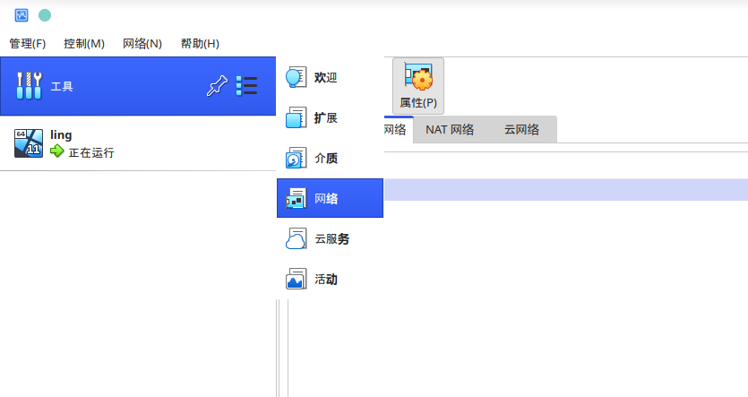​

点击DHCP服务器，启动服务器，也可以不使用DHCP，但需要在win虚拟机中手动设置ipv4地址。

这里需要注意，`VirtualBox >= 6.1.28 ​`​的版本上，默认指定的网段是192.168.56.0/24，无法更改为其他网段。因此不能够像这篇文章 [宿主机利用在虚拟机中建立的VPN加密隧道连接内网](https://www.freebuf.com/sectool/234695.html) 中提到的，修改VirtualBox的网段。

​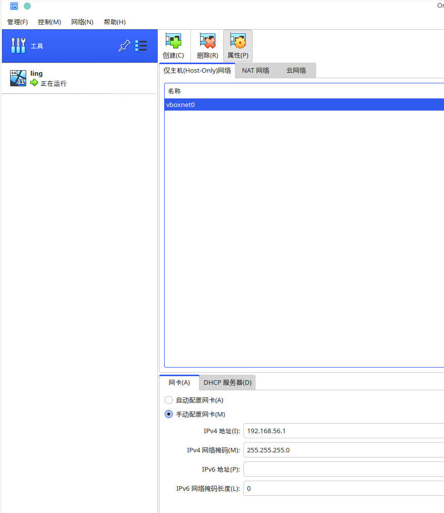​

​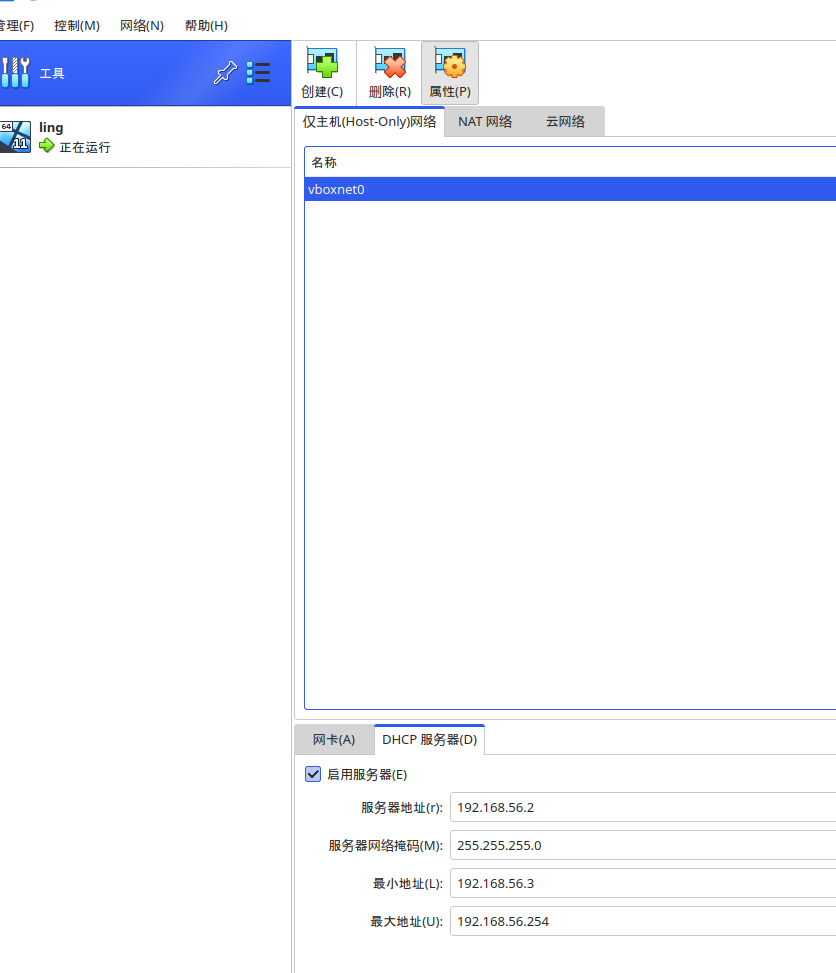​

添加完后，可以在主机中查看

```shell
ip addr
```

​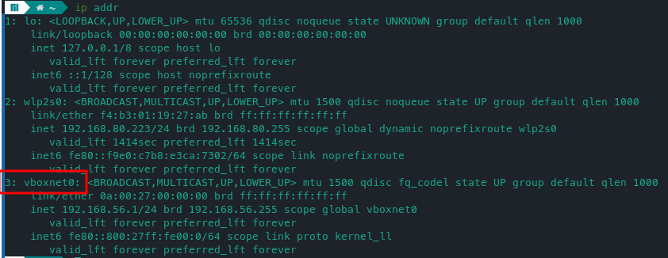​

‍

# 为虚拟机添加用于基本网络连接的网卡

在虚拟机对应的设置中，增加一个网卡，连接方式选择 `仅主机（Host-Only）网络`​。但需要先关闭虚拟机，否则无法进行更改，就像我这里一样，没有关闭虚拟机，按钮是灰色的。

​​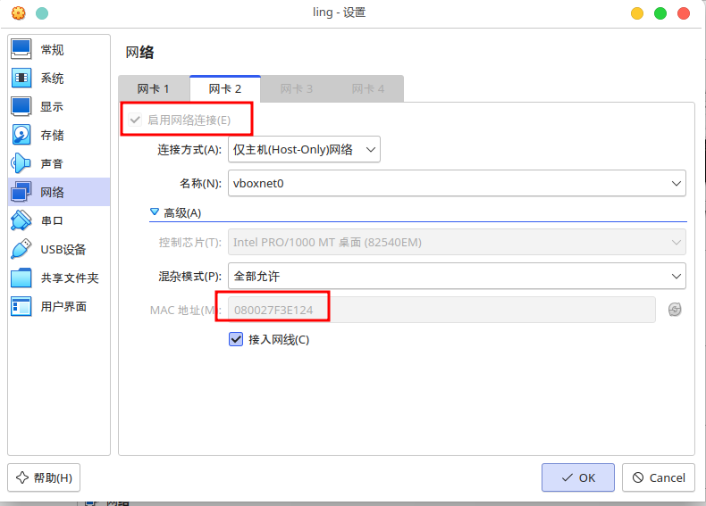​​

添加完成后，记住这里的MAC地址结尾E124，后续识别网卡的时候会用。打开虚拟机，进入设置->网络和Internet->高级网络设置->更多网络适配器选项。

​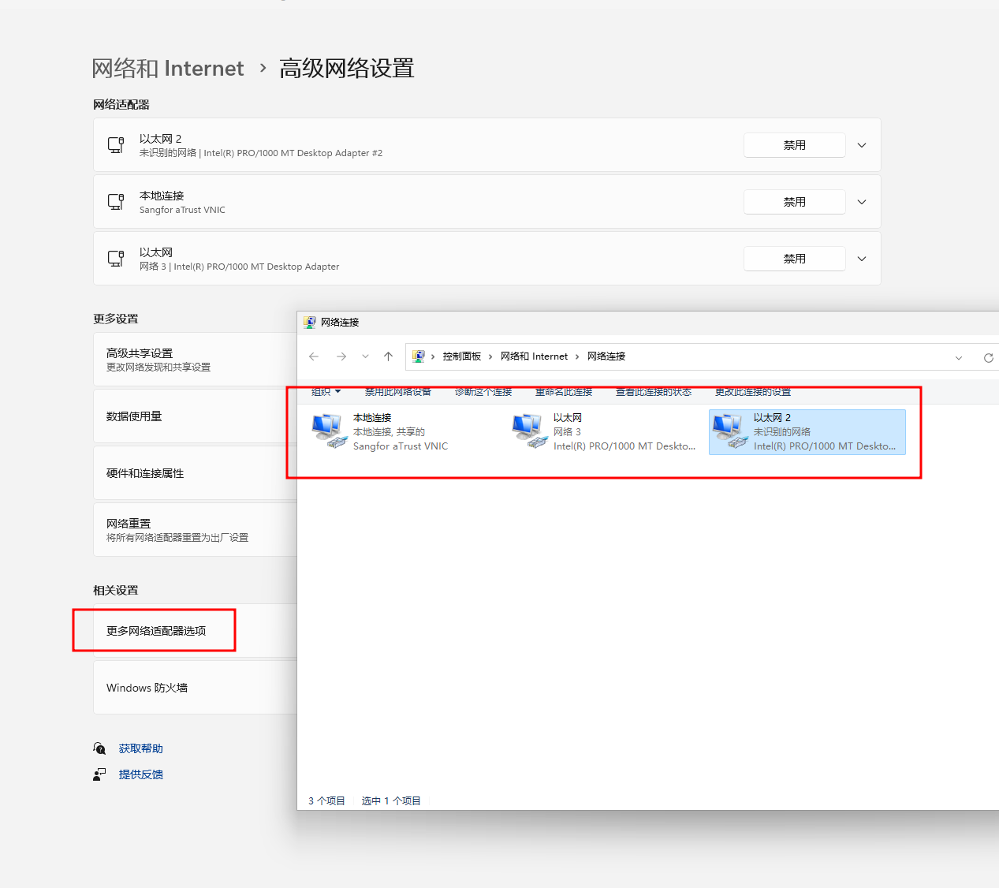​

这里的三个网卡，其中一个是深信服的Sanfor的网卡，也就是我这里的vpn软件。以太网是桥接网络的网卡，以太网2是host-only网卡。

可以在win11中的终端中输入命令`Get-NetAdapter`​查看，前面添加网卡的时候提到，E124结尾的是Host-Only，所以这里就可以区分出哪一些是VPN的网卡，哪一些是主机的。

​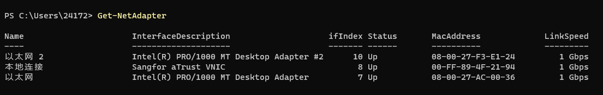​

然后开启VPN，转到网络适配器界面。右键VPN对应的网卡，选择 属性->共享，然后选择Host-Only网卡。

​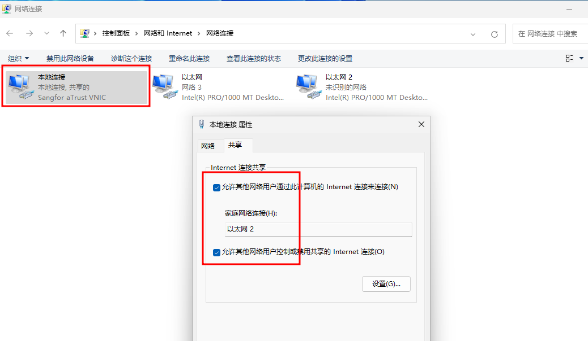​

这里win10以前的系统可能弹出提示窗，说会前行设置以太网2的IP为192.168.137.1，我是安装的win11，没有弹窗，但是会默认更改。因此，我们需要手动将Host-Only网卡的IP修改回原来的设定好的地址。

右键Host-Only网卡，选择属性，Internet 协议版本 4，然后双击，就会弹出修改IP的弹窗。

​​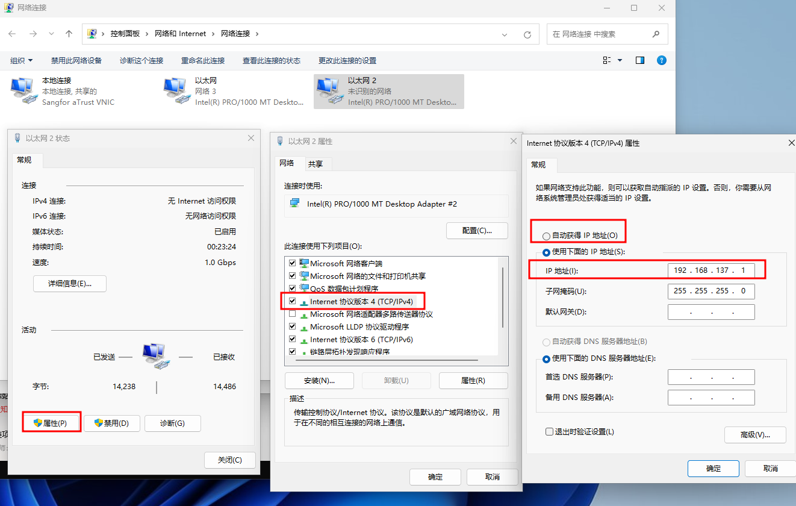​​

如果前面开启了DHCP，则可以点自动获取IP，否则需要手动改动IP为Host-Only网络段中与前面设置不同的IP地址。比如前面已经使用了 192.168.56.1 和 192.168.56.2，则就现在就需要设置为192.168.56.3。

设置完成后，回到host。

# 连通性测试和路由

设置完成后，在host的终端中，应该可以ping通虚拟机中的host网卡的地址  
​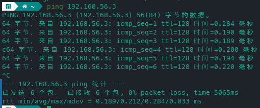​  

## 关闭win11防火墙

如果ping的时候，ping不通，显示无法到达，很可能是win11的防火墙没有开启报文回复功能。参考：[知乎回答](https://www.zhihu.com/question/37301003?utm_id=0)

在设置中按照 隐私安全性 -> Windows安全中心 -> 防火墙和网络保护，打开防火墙设置

​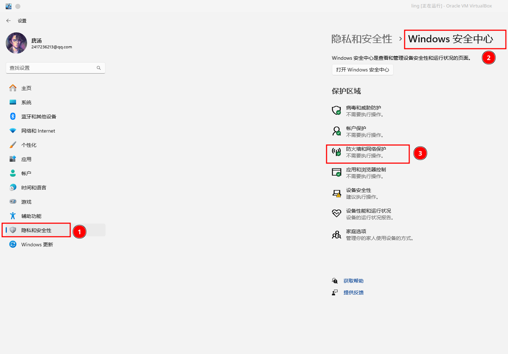​

然后打开高级设置，将入站和出站的`ICMPv4回显请求`​功能打开。

​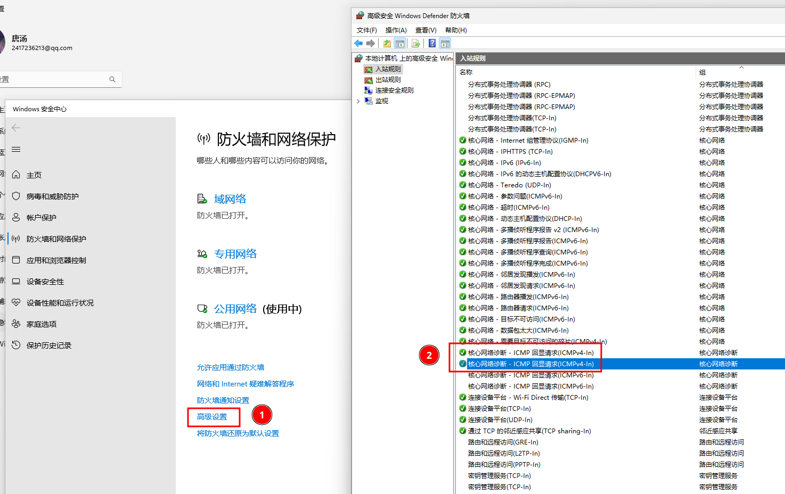​

# 添加路由规则

我使用的manjaro，默认安装的是ip工具，先查看当前路由表

```shell
sudo ip route
```

​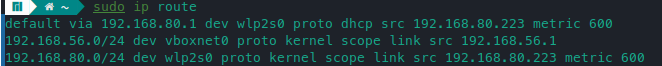​

可以看到192.168.56.0/24的网络段都会被路由到virtualBox的地址上去。但没有将VPN内网地址路由到虚拟机的表项。

因此需要添加路由规则，将VPN访问的网段路由到192.168.56.3，也就是之前在虚拟机中的host-only网卡中修改的地址。vboxnet0就是之前添加网卡时，系统中显示的网卡。

```shell
sudo ip route del 10.0.0.0/8 via 192.168.56.3 dev vboxnet0
```

我要访问的VPN网段为10.0.0.0/8，需要更改为自己的内网网段。

添加完成后再次查看

​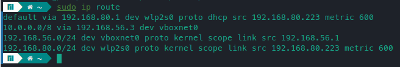​

然后就可以PING 自己的内网网段，就可以ping的通了。如果这里发现，一直收不到回复包，则在win11中重新将VPN的网卡分享到host-only网卡，然后修改host-only网卡。下一次开机时，也需要重复这个步骤，否则也会出现没有回复的情况。

​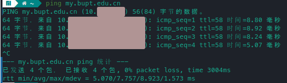​

设置完成后，如果重启虚拟机，则会自动将host-only网址增加192.168.137.1，手动将其移除也不能正常通信。需要重新分享网络，然后再更改ip。

​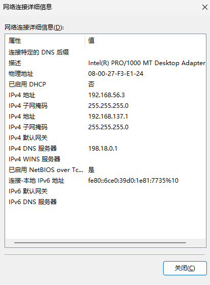​

目前还没有添加永久路由的方法

# 在主机中访问对应网段

当可以ping通时，就能够在主机中正常访问了。实测ssh到内网网段服务器也是可以的。

​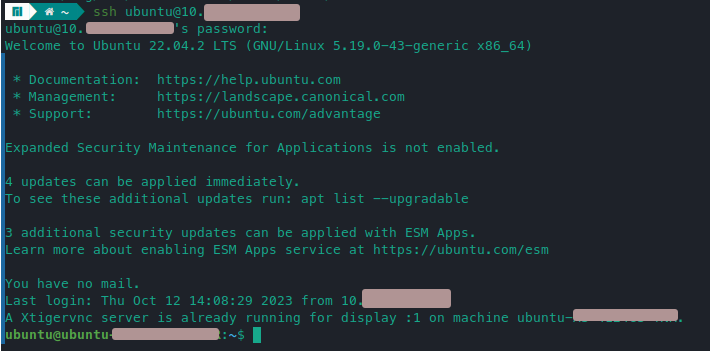​

且不会和主机中的vpn冲突。我的主机使用的是v2ray进行科学上网，实测对本文中的行为没有影响，如果使用其他方式，不能保证。

‍
