时间：2023/9/14/10:42

本文档旨在记录安装完成manjaro系统后，对系统开发和使用环境的配置，不介绍安装部分。manjaro的安装很人性化，不需要对分区作任何特殊操作，只需要按照使用场景选择对应的模式即可。

系统环境：

```shell
    ~  screenfetch                                                                                          ✔  13s  

 ██████████████████  ████████     ling@ling-s1series
 ██████████████████  ████████     OS: Manjaro 23.0.1 Uranos
 ██████████████████  ████████     Kernel: x86_64 Linux 6.5.1-1-MANJARO
 ██████████████████  ████████     Uptime: 2h 27m
 ████████            ████████     Packages: 1254
 ████████  ████████  ████████     Shell: zsh 5.9
 ████████  ████████  ████████     Resolution: 3840x1080
 ████████  ████████  ████████     DE: KDE 5.109.0 / Plasma 5.27.7
 ████████  ████████  ████████     WM: KWin
 ████████  ████████  ████████     GTK Theme: Breeze [GTK2/3]
 ████████  ████████  ████████     Icon Theme: Ant-Dark
 ████████  ████████  ████████     Disk: 43G / 453G (10%)
 ████████  ████████  ████████     CPU: Intel Core i5-8250U @ 8x 3.4GHz [75.0°C]
 ████████  ████████  ████████     GPU: NVIDIA GeForce MX150
                                  RAM: 6545MiB / 7826MiB

```

另一台机器：

```shell
    ~  neofetch                                                                                                                                                                                          ✔ 
██████████████████  ████████   ling@ling-20ym 
██████████████████  ████████   -------------- 
██████████████████  ████████   OS: Manjaro Linux x86_64 
██████████████████  ████████   Host: 20YM Lenovo ThinkBook 16p Gen 2 
████████            ████████   Kernel: 6.5.3-1-MANJARO 
████████  ████████  ████████   Uptime: 21 hours, 34 mins 
████████  ████████  ████████   Packages: 1366 (pacman) 
████████  ████████  ████████   Shell: bash 5.1.16 
████████  ████████  ████████   Resolution: 1920x1080, 2560x1600 
████████  ████████  ████████   DE: Plasma 5.27.8 
████████  ████████  ████████   WM: KWin 
████████  ████████  ████████   WM Theme: WhiteSur-Sharp 
████████  ████████  ████████   Theme: [Plasma], Breeze [GTK2/3] 
████████  ████████  ████████   Icons: [Plasma], WhiteSur [GTK2/3] 
                               Terminal: konsole 
                               CPU: AMD Ryzen 7 5800H with Radeon Graphics (16) @ 4.463GHz 
                               GPU: NVIDIA GeForce RTX 3060 Mobile / Max-Q 
                               GPU: AMD ATI Radeon Vega Series / Radeon Vega Mobile Series 
                               Memory: 15568MiB / 23392MiB 

```

安装软件screenfetch，neofetch即可命令行展示出上述信息。

# 配置镜像源

```text
sudo pacman-mirrors -c China -i -m rank 
```

命令执行后会弹出一个 UI 框来让你选择，默认速度最快的排在第一个（这里选择清华大学tsinghua的源）,然后点击“OK”，再次单击“确定”即可选择好最快的源。

​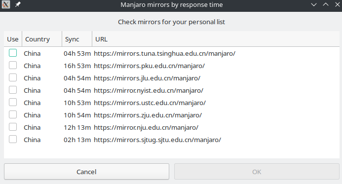​

打开终端输入以下命令，查看是否将源更改成功

```text
kate /etc/pacman.d/mirrorlist 
```

这句命令使用KDE自带的文本编辑器kate来编辑/etc/pacman.d/mirrorlist这个文件。这个文件中保存的就是pacman会使用的软件源地址。打开后会看到如下内容：

​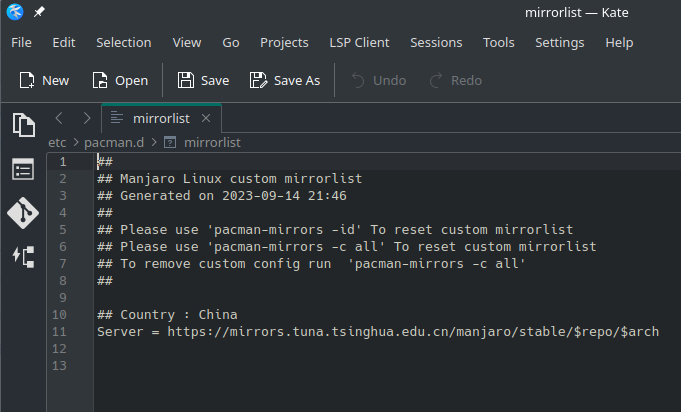​

然后更新一下软件仓库：

```text
sudo pacman -Syyu 
```

# **加入archlinuxcn源**

在命令行中使用kate打开/etc/pacman.conf。也就是执行命令

```text
kate /etc/pacman.conf
```

打开文件后拖到最下方，并且加入如下内容：

```text
[archlinuxcn]
Server = https://mirrors.bfsu.edu.cn/archlinuxcn/$arch
Server = https://mirrors.tuna.tsinghua.edu.cn/archlinuxcn/$arch
Server = https://mirrors.sjtug.sjtu.edu.cn/manjaro/stable/$repo/$arch
```

然后更新

```shell
sudo pacman -Syy && sudo pacman -S archlinuxcn-keyring
```

# 安装 yay

Manjaro 上默认使用的包管理工具是 pacman，但是这个工具不支持 AUR  软件仓库。AUR 全称是 ArchLinux User Repository，他是由社区驱动的软件仓库，  属于不受支持的软件仓库（unsupported）.但却是 Arch  社区最有活力的仓库，基本上你想要的软件可能官方源里面没有，但是这里面肯定有。yay 是对 pacman 的一个封装，使用上和 pacman  没有什么差别，但是它支持 AUR。注：yaurt已经过时，不建议安装。

```text
sudo pacman -S yay 
```

查看一下软件源:

```text
yay -P -g 
```

这里查询得到的数据应当是aur官方软件源，以前的教程都会让添加一些国内的aur源，但是现在已经不行了。

国内已经不支持AUR的镜像源了：[清华关于移除 AUR 镜像的通知](https://mirrors.tuna.tsinghua.edu.cn/news/remove-aur/)

因此更换镜像源后，也不能正常工作，会报错，**下列方法也会报错**，因此建议不更改官方软件源。aur官方源目前可以访问，但速度很慢，yay上的一些软件是通过aur官方源进行安装的，需要访问外网，因此需要先 安装V2ray 服务。

> [Manjaro如果yay使用了aur的清华源,出现报错，解决方法](https://blog.csdn.net/weixin_49927493/article/details/125615396)
>
> ​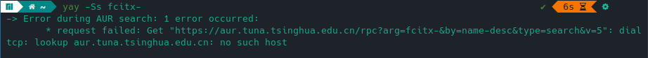​
>
> ```shell
>  -> Error during AUR search: 1 error occurred:
>         * request failed: Get "https://aur.tuna.tsinghua.edu.cn/rpc?arg=fcitx-&by=name-desc&type=search&v=5": dial tcp: lookup aur.tuna.tsinghua.edu.cn: no such host
> 或者
> response decoding failed: invalid character '<' looking for beginning of value;
> ```

安装完成后再次更新

```shell
yay -Syyu && yay -Sys
```

# 安装输入法

~~因为搜狗拼音现在还依赖着Fcitx-qt4，而这个包现在已经被官方源废除。而搜狗很久都没有迁移到qt5，所以现在Fcitx-sogoupinyin这个包也从官方仓库移除了。目前没法通过官方安装搜狗拼音。~~

2023.9.16在搜索pinyin安装包时（谷歌搜拼音并不好用），突然发现基于`fcitx5`​的安装包`fcitx5-pinyin-sougou`​，但该包不能正确安装。因此，替换原来的谷歌拼音。过程如下

## 搜狗拼音

参考链接：[Manjaro安装Fcitx5中文输入法](https://zhuanlan.zhihu.com/p/468426138)

由于之前已经安装了`fcitx4`​，而`fcitx5`​与其冲突，因此需要先卸载：`sudo pacman -Rs $(pacman -Qsq fcitx)`​

### 安装fcitx5

```text
sudo pacman -S fcitx5 fcitx5-configtool fcitx5-qt fcitx5-gtk fcitx5-chinese-addons fcitx5-material-color kcm-fcitx5 fcitx5-lua
```

由于这里复制出错，导致没有正确退出pacman程序，其进程锁没有正常释放，因此，需要手动删除锁，参考链接： [Manjaro使用pacman提示无法锁定数据库](https://blog.csdn.net/weixin_34190136/article/details/92464438)。（注：该链接的environment配置有误）

其实报错信息也给出提示​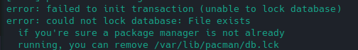​

删掉之前的文件： `/var/lib/pacman/db.lck`​。`sudo rm /var/lib/pacman/db.lck`​。就正常了。关于主题部分就不进行配置了，默认的即可。

还有一点，和谷歌拼音对输入法的配置一样，也需要加入环境变量。

### 配置environment

```shell
kate /etc/environment
```

将下面的内容添加到其中，原因为environment在所有用户登陆时都有效。

```shell
GTK_IM_MODULE=fcitx
QT_IM_MODULE=fcitx
XMODIFIERS=@im=fcitx
INPUT_METHOD=fcitx
SDL_IM_MODULE=fcitx
```

如果不进行环境的配置，那么重启之后不能正常切换输入法，也就不能输入中文。

### 配置输入法

中文输入法插件的名称为Pinyin,这是在开发者的仓库中发现的，否则不清楚名称，无法确定哪一个是我们安装的，就不能添加到配置中使用。[原仓库链接](https://github.com/fcitx/fcitx5-chinese-addons)

​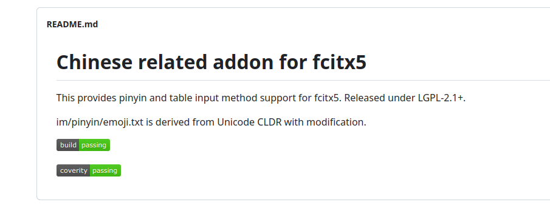

添加Pinyin

​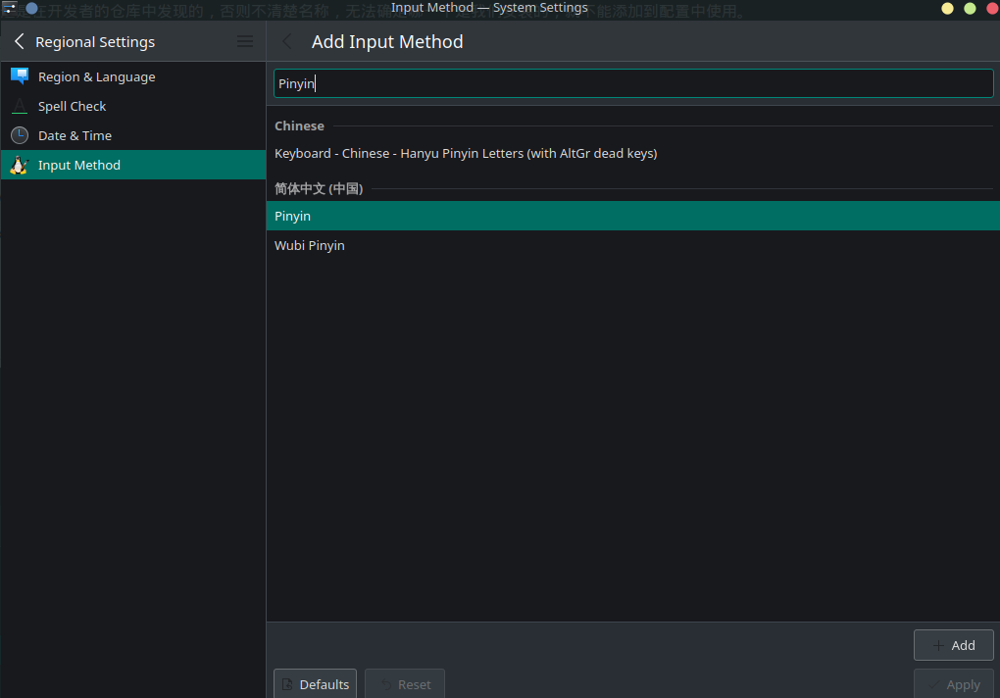​

添加成功后可以看到

​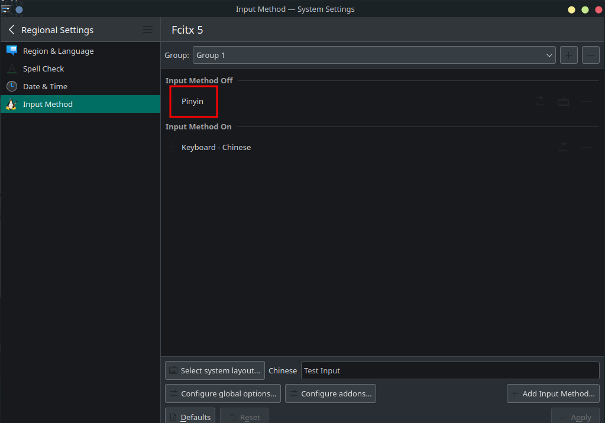​

如果正确配置了仍然不能切换出想要的输入法，可以查看Group是否正常切换。默认的应该有两个Group，所有很可能是Group不正确。

​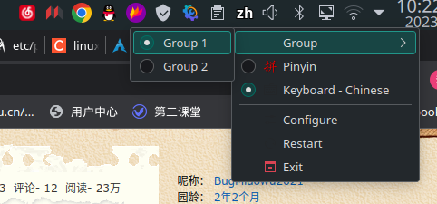​

## 谷歌拼音

安装谷歌拼音参考：[manjaro Linux，有什么较为简单的方法，可安装中文输入法? - 知乎用户0C8Unl的回答 - 知乎](https://www.zhihu.com/question/330715155/answer/1051545736)

```shell
sudo pacman -S fcitx-im
yay -S fcitx-configtool
yay -S fcitx-googlepinyin
```

KDE 或者其他桌面配置:

输入kate ~/.xprofile或nano ~/.xprofile 并且加入如下内容（也可以按照上一节的environment添加）:

```text
export GTK_IM_MODULE=fcitx

export QT_IM_MODULE=fcitx

export XMODIFIERS=@im=fcitx
```

> 配置好了之后要注销或者重启一下才可以生效;  
> 第一个输入法需设置为键盘格式。

重启后，在下面的状态栏中找到键盘图标

​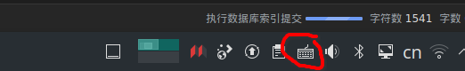​

然后进入配置（Configure），点击加号，通过搜索，找到谷歌拼音，并添加到输入法中。然后就可以通过`ctrl`​+`shfit`​切换输入法了。

​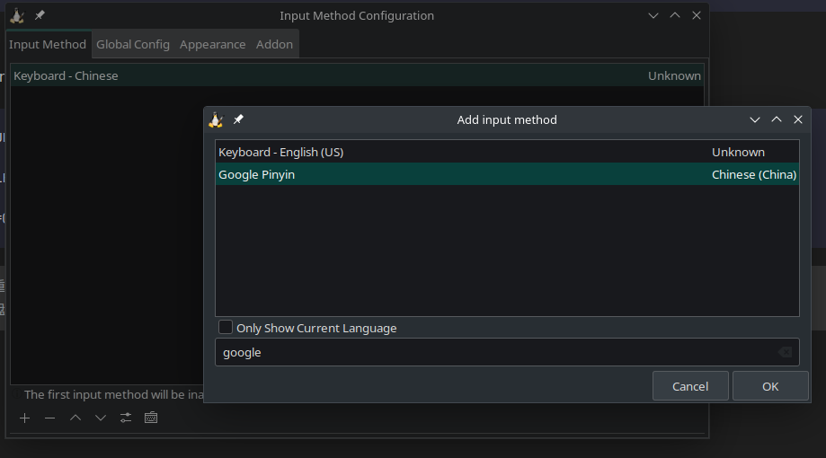

需要注意：在输入密码时，如果仍然处于中文输入法的话，会按照中文字符进行输入。

安装输入法后，使用shfit无法切换输入法，需要在fcitx中的全局设置中，增加切换激活/非激活输入法快捷键

​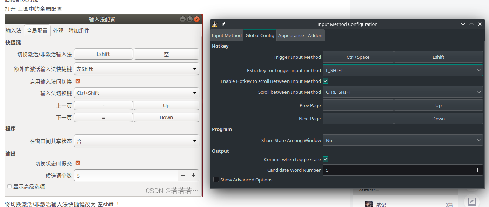​

参考链接：[安装google输入法后，左shift键不能切换中英文](https://blog.csdn.net/qq_43409608/article/details/121751301)

# 安装软件

## **timeshift**

**强大好用的备份、回滚系统工具。装好Manjaro必须要做timeshift，以防你哪天玩坏只能重装**

```shell
yay -S timeshift
```

关于这个软件的使用，详见另一篇：

建议：不要在不同的电脑上通过timeshift进行备份迁移，我已经尝试过，能够进入系统，但是应该是由于驱动不适配，最后无法进入系统，只能在登陆界面反复登陆。

## 思源笔记

本地储存优先的笔记软件，支持markdown,也支持云同步，但主要内容都是先存放在本地，不需要放在任何云端。

```shell
yay -S siyuan-note-bin
```

## qq

目前qq已经原生支持linux

```shell
yay -S linuxqq
```

qq运行一段时间后闪退，甚至刚刚登陆上就闪退。在AUR论坛中找到问题及解决方案：[aur.archlinux.org](https://aur.archlinux.org/packages/linuxqq)

​​

> 在关机时若未主动退出qq，重启后会导致闪退。手动移除 `~/.config/QQ/crash_files`​ 文件夹可以解决问题。

另在v2ex论坛中，也找到了解决方案，并且可以解决重复删除文件夹的问题，在删除`crash_files`​中的内容后，将该文件夹设置为只读。

​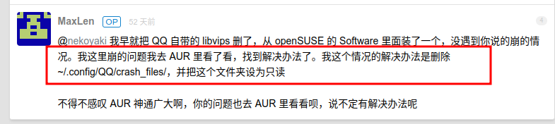​

参考：[[求助] Linux 下 QQ 闪退问题](https://www.v2ex.com/t/959776)

## qq音乐

```shell
yay -S qqmusic-bin
```

## Chrome谷歌浏览器

```shell
yay -S google-chrome
```

## Watt Toolkit：Steam++

不使用代理就可以访问github或者steam。与科学上网不同，仅仅能够访问一些常见的但没有被ban的网站。安装此软件主要是为了在安装科学上网环境之前能够正常访问github，便于我们下载源码进行安装。

Watt Toolkit是一个本地通过反向代理实现的访问github等常见的网站的工具，其优势就是访问网站的速度和不使用代理一样。而科学上网的网速需要看代理服务器的速度。

```shell
yay -S watt-toolkit-bin
```

安装后启动，勾选github进行加速

 ​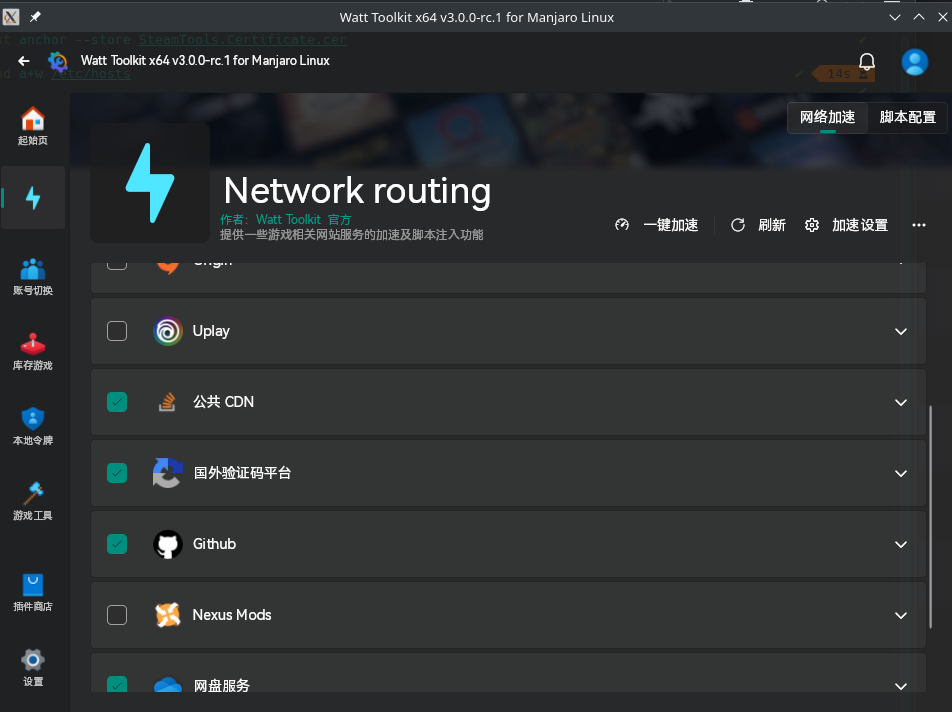​

启动时会转到浏览器，要求先做一些操作：

* 利用火狐浏览器导入证书

  ​​

  ‍

  证书文件在`/home/ling/.local/share/Steam++/Plugins/Accelerator/SteamTools.Certificate.cer`​，其中ling为用户根目录。

  然后输入命令`sudo trust anchor --store SteamTools.Certificate.cer`​，没有尝试过不输入，输入后启动正常工作。

  ​

* 需要输入命令`sudo chmod a+w /etc/hosts`​​，避免每次输入密码

  ​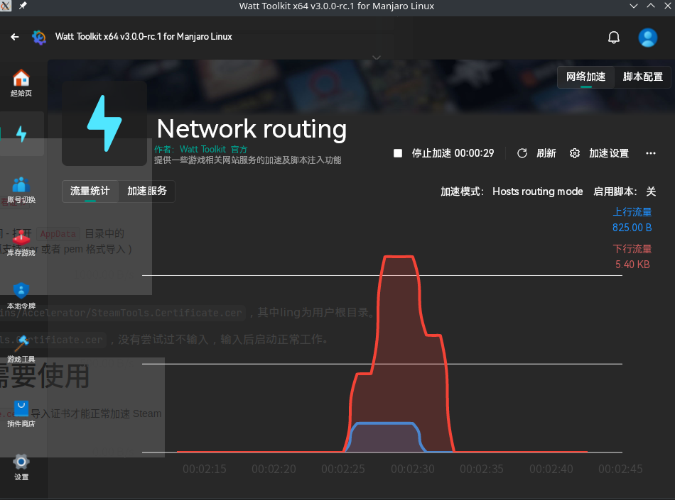​
* 如果只安装火狐浏览器，可能导入了证书也用不了（当前版本），因此需要安装Chrome，参见上一节Chrome浏览器安装。
* 如果还不行，则在开始加速以前，点击右边的刷新按钮，显示加速成功即可。

## vscode

```shell
yay -S visual-studio-code-bin 
```

## clion

```shell
yay -S clion
```

有问题，提示没有java环境

​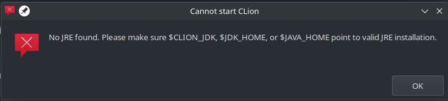​

根据官方论坛的回答，需要安装两个依赖，[Can’t open CLion](https://forum.manjaro.org/t/cant-open-clion/120136)

```shell
yay -S java-runtime clion-jre
```

## flameshot-截屏软件

```shell
yay -S flameshot
```

需要在设置中找到快捷键设置，将flameshot添加到快捷键中，然后设置对应的快捷键。

​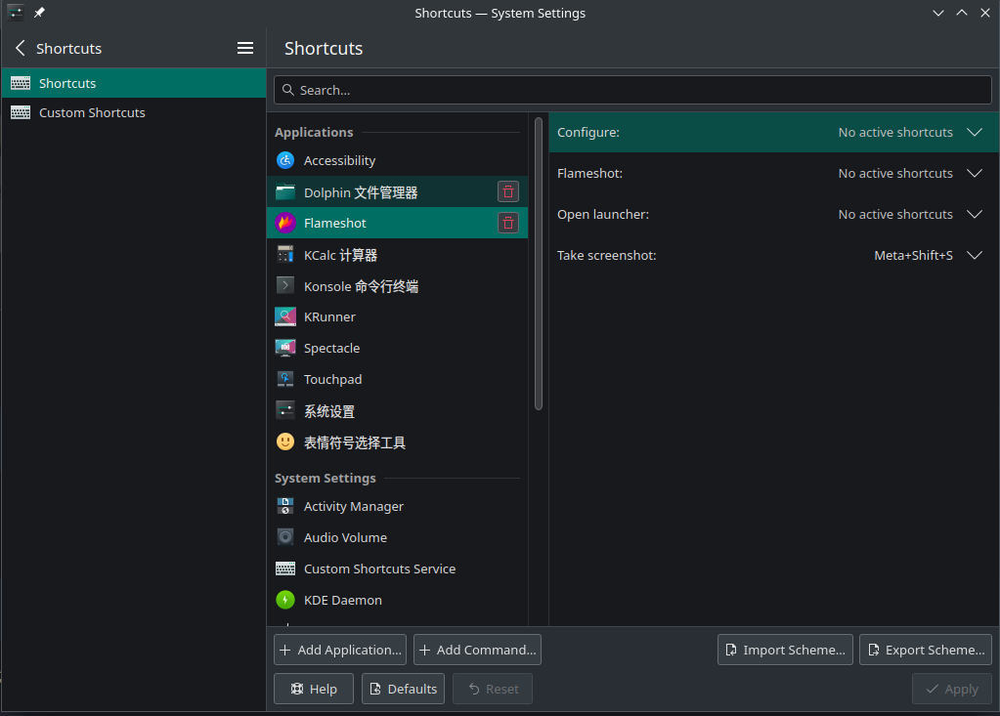

需要注意点是，linux下的截屏并不能对右键菜单进行截屏，即使通过快捷键。因此需要利用延时截屏的功能。flameshot的延时截屏需要通过`Open launcher`​然后进行截屏。

​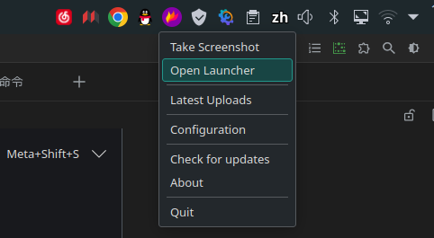​

点击后就会出现窗口，选择延时的时间。

​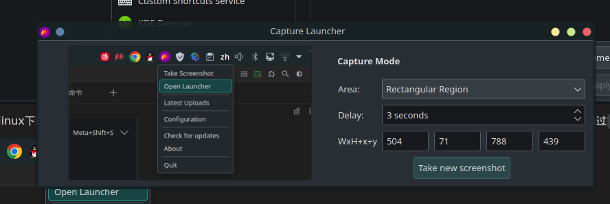

然后就可以实现截屏右键。参考：[Ubuntu 中如何对右键菜单进行截图](https://blog.csdn.net/amnesiagreen/article/details/108623868)

​​

## cmake

```shell
yay -S cmake
```

## clash for windows

```shell
yay -S clash clash-for-windows-bin 
```

free节点仓库

```shell
https://github.com/xrayfree/free-ssr-ss-v2ray-vpn-clash
```

参考链接：[blog.linioi.com/posts/cl...](https://blog.linioi.com/posts/clash-on-arch/)

manjaro下的系统代理和其他发行版不同，设置系统代理后，仍然有部分程序不会通过系统代理上网。比如火狐浏览器，chrome浏览器。

因此对于在浏览器中的科学上网，需要分别在两个浏览器中设置代理服务器的地址。

### FireFox

在设置中，General -> Network Settings中，进行设置，一般设置为Manual，也就是手动设置代理。

​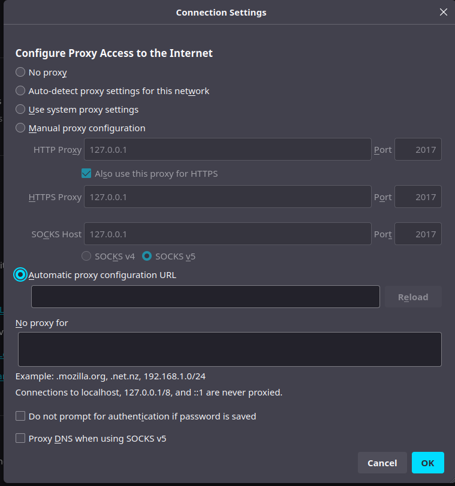​

### Chrome

Chrome没有代理网络设置，需要在启动文件中增加启动参数

参考链接：[在Linux上为Google Chrome配置代理设置](https://qastack.cn/superuser/83007/configuring-proxy-settings-for-google-chrome-on-linux#:~:text=%E4%BB%A5root%E8%BA%AB%E4%BB%BD%E8%BF%90%E8%A1%8C%EF%BC%8C%20gedit%20%2Fusr%2Fshare%2Fapplications%2Fgoogle-chrome.desktop,%E7%84%B6%E5%90%8E%E6%A0%B9%E6%8D%AE%E9%9C%80%E8%A6%81%E6%B7%BB%E5%8A%A0%E4%BB%A3%E7%90%86%E8%AE%BE%E7%BD%AE%EF%BC%8C%E5%8D%B3%20--proxy-server%3D%22http%3A%2F%2F127.0.0.1%3A8080%22%20%E4%BF%9D%E5%AD%98%E5%B9%B6%E8%BF%90%E8%A1%8Cchrome%E3%80%82)

​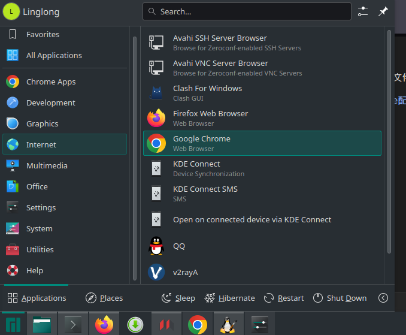​

右键Chrome图标，选择`Edit Application...`​编辑启动参数，增加`--proxy-server=127.0.0.1:7890`​，这是clash的代理地址，可以根据自己的代理软件进行设置。

​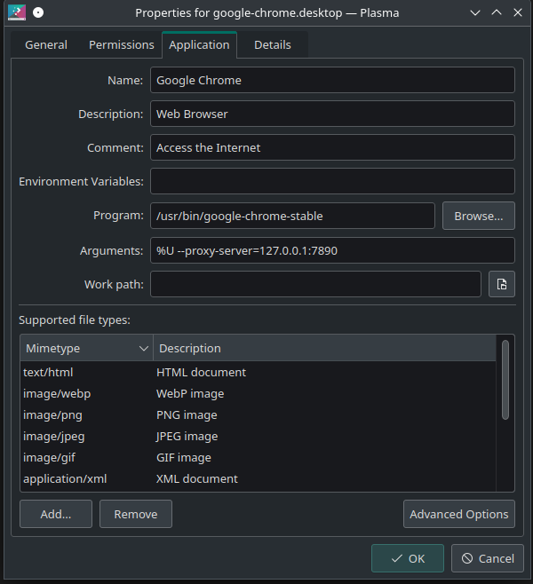​

application的源文件地址有两个，一个是菜单栏的地址`/home/ling/.local/share/applications/google-chrome.desktop`​​，一个是程序安装后的地址`/usr/share/applications/google-chrome.desktop`​​。

为了使用方便，建立两个Chrome的desktop文件，都放在usr下的文件目录里，在应用程序的启动菜单里就会自动分类。需要使用哪一个就启动哪一个。但需要注意，chrome关闭后是最小化在状态栏，需要手动关闭后再打开新的chrome，否则不会刷新程序。

## make

```shell
yay -S make
```

## todesk远程软件

```git
yay -S todesk-bin
```

注意，不要安装`todesk`​，而是安装`todesk-bin`​，前者不是最新版本。

安装完成后，会提示开启守护进程，否则将不能正常使用该软件。守护进程类似于windows中的服务。

​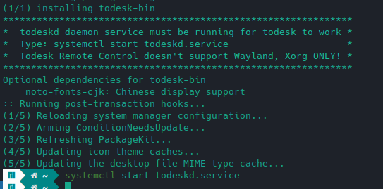​

```git
systemctl start todeskd.service
```

## windows字体安装

参考链接：[manjaro踩坑记(2022更新版)](https://mrswolf.github.io/my-manjaro-log/)

AUR提供了ttf-ms-win10的安装包，不过不提供字体文件，需要自己从已有的win10系统（拷贝所有C:\Windows\Fonts下的字体文件）或从win10镜像中抽取字体文件。

安装字体有缺陷

​​

​

图标符号显示为方块，这是由于konsole的默认配置文件中并没有对字体做限制，因此，显示的字体会随着系统全局使用的字体而改变。只要在字体设置中，改变对应位置的字体为支持manjaro的图标的字体即可。

在Manjaro官方论坛得知，使用的字体为MesloLGS。可以通过命令行安装（一般已经安装了，只是没有启用，如果你在系统的字体管理中没有发现该字体，则需要手动安装）

```sh
yay -S ttf-meslo-nerd-font-powerlevel10k
```

然后在系统设置->外观->字体->固定宽度，将其字体更改为MesloLGS即可。然后重启konsole,就可以看到图标显示正常了。

​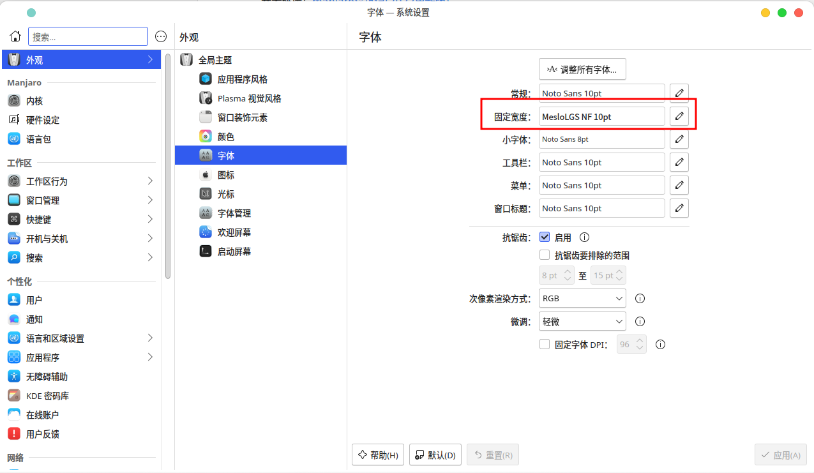​

### 直接拷贝

由于本作者使用的是双系统下的manjaro，因此我可以直接从windows的c盘直接拷贝字体文件。

首先从AUR克隆tff-ms-win10仓库：

```shell
cd ~/Desktop # 进入用户目录下的桌面
mkdir -p build && cd build # 在桌面建立build文件夹
git clone https://aur.archlinux.org/ttf-ms-win10.git
```

修改ttf-ms-win10仓库中的PKGBUILD如下段落，添加的字体文件表示仿宋、黑体和楷体：

```shell
_ttf_ms_win10_zh_cn=(
simsun.ttc                                             
simfang.ttf simhei.ttf simkai.ttf # 增加这行内容
simsunb.ttf                                             
msyh.ttc   
msyhbd.ttc                               
msyhl.ttc
```

然后将windows的`​ C:\Windows\Fonts`​下面的所有文件拷贝到桌面的`build`​文件夹中。再拷贝license文件（`C:\Windows\System32\Licenses\neutral\_Default\Professional\license.rtf`​）到桌面的`build`​文件夹中。

最后在ttf-ms-win10目录下执行安装命令，注意如果报错，大概率是当前抽取的字体文件中没有该字体，可以按照错误提示从网上下载ttf文件加入其中，或者在PKGBUILD里删掉该字体，毕竟只有中文字体比较重要：

```shell
makepkg -sic --skipchecksums
```

### 从win10镜像中抽取字体文件

注：以下方法作者并没有尝试过

挂载win10安装镜像，manjaro下只需要右键选择挂载ISO，Dolphin的左边即可出现ISO的访问文件路径，找出source文件夹下的install.esd或install.wim文件，把该文件拷贝到ttf-ms-win10仓库文件夹下，执行如下命令解锁所有字体文件：

```
wimextract install.esd 1 /Windows/{Fonts/"*".{ttf,ttc},System32/Licenses/neutral/"*"/"*"/license.rtf} --dest-dir .
```

其余步骤与直接拷贝相同。

## 网易云音乐-微信安装总结

在本文中，将提到许多中安装微信的方法，包含windows原生版本的微信、经过deepin打包的wine版本的微信、对spark商店中微信打包版本的微信等。网易云音乐现在只推荐使用基于deepin-wine/wine-for-wechat联合版本的windows直装版。具体的原因在后面两者的详细安装步骤中会解释。如果只希望安装这两个软件，则可以跳过后面的详细安装介绍章节，直接运行下列命令：

```shell
yay -S dh-autoreconf # manjaro下需要手动安装deepin的依赖
yay -S deepin-wine-wechat # deepin版本的微信
sudo pacman -S wine-for-wechat
yay -S com.qq.weixin.spark # 微信
wine NeteaseCloudMusic_Music_official_2.10.12.201849_32.exe # 网易云音乐，NeteaseCloudMusic_Music_official_2.10.12.201849_32.exe是在官网下载的windows安装包
```

这里安装了两个版本的微信，但其数据互通，微信的数据文件都在`～/Documents/WeChat Files`​中。为了微信功能的完整性，请先打开deepin微信，然后关闭。再打开spark版本的微信，此时spark版本的微信所有功能都可以使用。**注：如果出现中文字体变成方块字等显示问题，建议参考本文中的 ​**windows字体安装 **部分。**

deepin版本的启动入口在：

​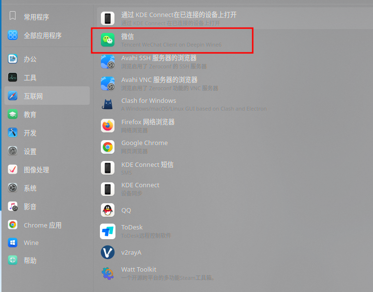​

第一次启动需要安装，安装后点立即打开会崩溃，但再次启动微信就正常了。

spark版本的启动入口在：

​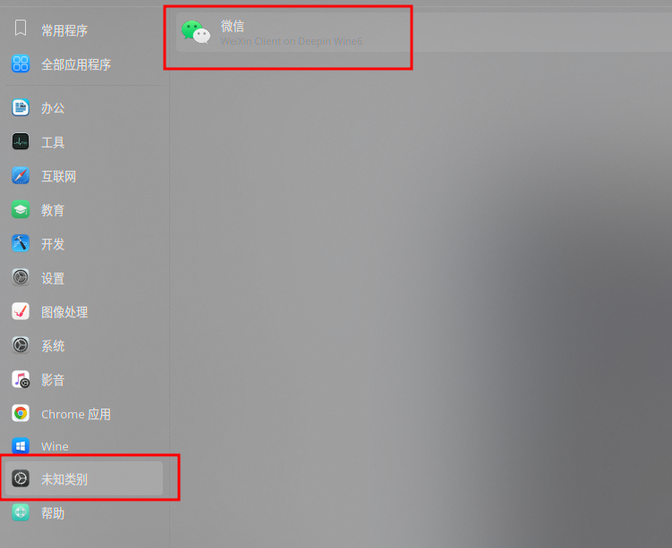​

同样第一次启动需要安装

​

在deepin版本的微信安装后，再安装spark版本的微信，则订阅号相关的功能就会变正常。如果只安装deepin版本，或者只安装spark版本的微信，打开这些界面会黑屏或者不显示。

​​

网易云音乐直接打开安装即可，所有功能全部正常。

## 微信

### deepin版本的微信

直接安装`deepin-wine-wechat`​失败，提示有三个包不能直接安装，其中一个是`deepin-wine6-stable`​，错误原因是系统找不到`autoreconf`​，这个软件直接搜索是没有的，因为是在debian系linux才有，但是仍然通过yay搜索得到`dh-autoreconf`​，其说明表示这是deb的helper，能帮助添加`autoreconf`​。因此安装这个包。

```shell
yay -S dh-autoreconf
```

安装后，再安装微信

```shell
yay -S deepin-wine-wechat
```

但这个版本的wechat不能登录，扫码登录后，会要求输入安全码，但是linux上并没有输入窗口，因此废弃这个版本。**但这个版本的wine对于后续的网易云安装是必须的！因此一定要先安装deepin版本的微信！但这个版本的wine对于后续的网易云安装是必须的！因此一定要先安装deepin版本的微信！但这个版本的wine对于后续的网易云安装是必须的！因此一定要先安装deepin版本的微信！**

### uos版本的微信

uos的桌面版本只有最基本的聊天功能。`yay -S wechat-uos`​。不推荐安装。

### 直接安装微信

需要使用wine模拟windows的应用层，然后就像在windows中安装软件一样。

```shell
sudo pacman -S wine-for-wechat wine-wechat-setup  # wine-wechat-setup可以不安装
```

其中wine-for-wechat​​是对微信和网易云专门做了修改的wine版本，wine-wechat-setup​​是对wine-for-wechat​​​​的安装和启动写了一个封装。只要有wine-for-wechat​​就可以安装，wine-wechat-setup​​会让安装过程更方便。

安装成功后，需要去官网下载最新版本的微信，然后运行下列命令，在安装之前，需要先 ((20230916200607-hootjp8 "安装字体"))。

这里需要说明的，`wine-wechat-setup`​会给微信单独文件夹安装，如果安装了`wine-wechat-setup`​则使用下面的命令进行安装：

```shell
wechat -i WeChatSetup.exe
```

否则，使用下面的安装：

```shell
wine WeChatSetup.exe
```

其中WeChatSetup.exe为下载下来的安装包。注意（微信版本3.9.7，wechat-setup版本1.4）64位的安装包会有聊天框白框的问题，因此选择安装32位的包（WeChatSetup_x86.exe）。**注意：这里仅仅针对的是没有提前安装deepin版本的情况，如果提前安装了deepin版本的微信，则无论哪个包都会有白框！如果需要直装，则不能安装deepin版本，这样的后果是网易云音乐无法正确使用！**

另外还有中文字符显示方框的问题，这个问题比较简单，但解决的方式有很多，大部分不一定有用。目前的解决方式参见本文中的windows字体安装部分。

在官方仓库的issues中：[wechat相关问题](https://github.com/archlinuxcn/repo/issues?q=is%3Aissue+is%3Aclosed+wechat)。这里提到的大部分解决字体的方法不适用于目前的版本。请不要在这上面浪费时间，直接使用上面的windows字体安装。如果不按照上面的方法，则下面的步骤也可以正常解决问题，但数字、英文部分的排版会很奇怪。

#### 安装字体

```shell
yay -S ttf-ms-fonts
sudo pacman -S ttf-roboto noto-fonts ttf-dejavu
sudo pacman -S wqy-bitmapfont wqy-microhei wqy-microhei-lite wqy-zenhei
sudo pacman -S noto-fonts-cjk adobe-source-han-sans-cn-fonts adobe-source-han-serif-cn-fonts

yay -S ttf-ms-fonts
```

安装字体后再安装微信，就没有方框问题了，不需要修改注册表，以及复制字体到wine环境。

由于其有一些使用上的小问题，最终选择spark版本的微信。

### spark版本的微信

安装spark商店版本的微信：`yay -S com.qq.weixin.spark`​。spark版本的可用，且功能完善。

与直装的方式的微信比较以后，发现直装的字体虽然能显示，但是数字以及一些字体很怪。但是直装方式可以安装网易云音乐。spark版本的微信需要用到wine（`deepin-wine-wechat`​提供了魔改的wine），只要有wine即可。**为了后续的网易云音乐安装**，需要先安装`deepin-wine-wechat`​。因为`deepin-wine-wechat`​包含了网易云音乐所需要的显示库`gdiplus.dll`​。但只有`deepin-wine-wechat`​还不够，因为只安装`deepin-wine-wechat`​不会提供wine命令，就不能够通过wine安装网易云音乐的安装包了。所以还需要安装`wine-for-wechat`​。网易云音乐的流程见网易云音乐章节。

```shell
sudo pacman -S wine-for-wechat
yay -S com.qq.weixin.spark 
```

spark版本的入口为：

​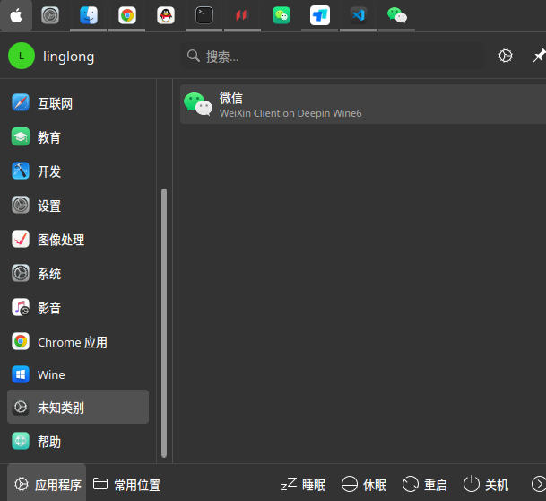​

修改缩放的方式如下，参考链接：[com.qq.weixin.spark](https://aur.archlinux.org/packages/com.qq.weixin.spark)

​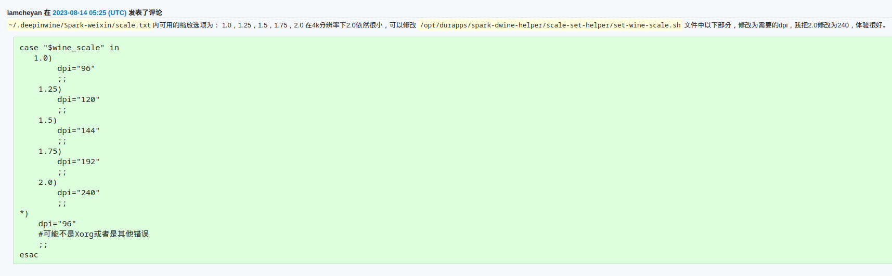​

由于我目前使用的屏幕为1080p，不需要修改dpi。直接修改文件中的值为1就行。

### 总结

最终选择spark版本的微信，功能完善，不需要修复任何问题，开箱即用。但需要注意的是，要先通过直装方式安装，因为网易云音乐需要前面的环境。

## 网易云音乐

经过反复的尝试，原生的网易云音乐已经不能够正常登陆了，详情见：[发现Ubuntu网易云音乐几乎不能用了](https://www.cnblogs.com/SendBoringBackToNoWhere/p/17633696.html)。因此，之前通过官方的linux版本已经无法使用。而其他的第三方客户端，都是基于网页版的网易云音乐作适配，而网页版的功能很少，像心动模式就没有。在本文中安装微信的一节中提到，可以通过直装的方式进行安装，并且要先安装`deepin-wine-wechat`​和`wine-for-wechat`​。

先去官网下载安装包到本地。然后通过`wine`​命令安装网易云，通过`wechat`​命令安装也可以，但是没有快捷启动。因此直接通过`wine`​安装。

```shell
yay -S deepin-wine-wechat 
sudo pacman -S wine-for-wechat
wine NeteaseCloudMusic_Music_official_2.10.12.201849_32.exe
```

原因及解释：deepin的wine有原装的gdiplus库，但安装deepin的wechat并不会给wine的调用接口，因此无法通过wine命令安装网易云音乐。当安装wine-for-wechat后，不会修改原来的wine文件夹，仅仅是提供wine命令。这一步其实没有安装新的wine。然后就可以直接安装网易云音乐的包，就可以正常运行网易云！

## V2ray

也是一种科学上方式，由于clash在manjaro上的体验不好，不能停止代理，以及代理效果不好。故使用v2ray协议进行科学上网。

v2ray也有GUI配置，只需要安装两个软件即可

```shell
yay -S v2ray v2raya
```

### 运行v2raya的服务，否则无法使用

```shell
sudo systemctl start v2raya.service #启动 v2rayA
sudo systemctl enable v2raya.service 设置开机自动启动
```

参考链接：[V2rayA在linux 下安装使用教程](https://zhuanlan.zhihu.com/p/414998586)

### 开始设置

通过 2017 端口 如 [http://localhost:2017](https://link.zhihu.com/?target=http%3A//localhost%3A2017/)访问 UI 界面。

（如果无法访问，请检查你的服务是否已经启动，[相关问题](https://link.zhihu.com/?target=https%3A//github.com/v2rayA/v2rayA/issues/237)）

官方教程：[官方教程](https://v2raya.org/docs/prologue/quick-start/)

#### 创建账号

在第一次进入页面时，你需要创建一个管理员账号，请妥善保管你的用户名密码，如果遗忘，使用`sudo v2raya --reset-password`​命令重置。

然后导入节点

free节点仓库

```shell
https://github.com/xrayfree/free-ssr-ss-v2ray-vpn-clash
```

按照其中的方式连接，即可正常科学上网。比起clash好用的多。可以自动代理，自己选择代理方式等。不需要对浏览器单独配置。

对于v2raya的设置，可能需要按照下面进行设置

​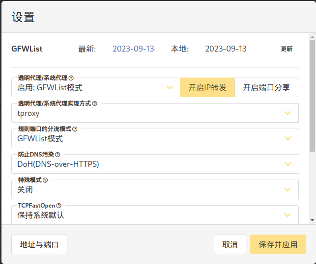​

## wps-office

```shell
yay -S patch wps-office wps-office-mui-zh-cn ttf-wps-fonts
```

### WPS加粗字体显示错误，显示成一团黑

解决方案：[Wps很多字体的加粗都显示异常的问题](https://forum.manjaro.org/t/wps/144447)。如图：

​​

降级 freetype2 (2.13.2-1 → 2.13.0-1) 即可解决问题

如果是更新包后，出现问题，则系统应该会保留旧包的缓存，可以直接执行

```sh
sudo pacman -U /var/cache/pacman/pkg/freetype2-2.13.0-1-x86_64.pkg.tar.zst
```

如果提示包不存在，则说明缓存被清理，或者以前没有安装过旧版。

​​

需要去官方备份下载旧版本，手动安装。官方备份网站：[归档](https://archive.archlinux.org/)

​​

## obs-studio 录屏软件

```c
sudo pacman -S obs-studio 
```

目前最新版为`obs-studio 29.1.3-1`​，这个版本改进了 VAAPI H264 支持，并使用Nvidia的驱动程序`libva-vdpau-driver`​，但这个程序已经很久没有改进了，是这个驱动的问题导致obs启动崩溃。

解决方案：卸载`libva-vdpau-driver`​，`yay -R libva-vdpau-driver`​，如果实在需要硬件加速，则应安装现在官方活跃的驱动版本：`sudo pacman -S nvidia-vaapi-driver ​`​，这是一个仍在活跃的改进版：[nvidia-vaapi-driver](https://github.com/elFarto/nvidia-vaapi-driver/)。

参考链接：[OBS 29 linux 启动时崩溃分段错误](https://github.com/obsproject/obs-studio/issues/8056)

## 开机自启动

参考链接：[Manjaro添加软件或者脚本自启动](https://blog.csdn.net/leigelaile1/article/details/105475105)

将需要启动的软件的`desktop`​文件或者脚本放在~/.config/autostart 文件夹下，开机会自动加载。

​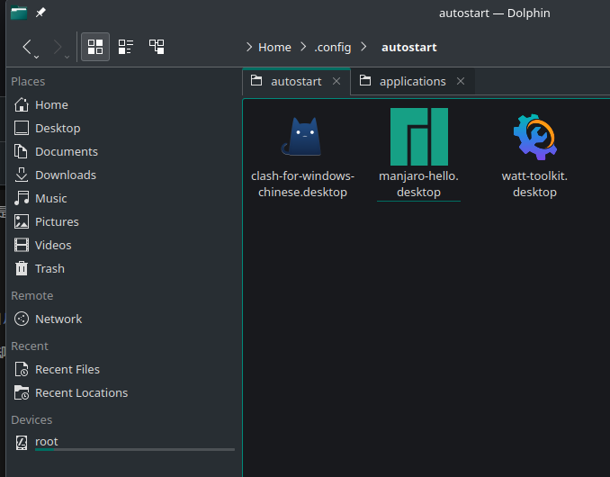​

针对开机自启动，linux有一套自己的方法，而manjaro又有一套不同的流程。

上述方式是最简单的一种。参考链接：[Manjaro开机自启动脚本实现](https://github.com/MregXN/blogs/issues/2)，[Linux开机流程整理](https://github.com/MregXN/blogs/issues/1)

在linux内核加载完成后，会启动初始化程序，也就是第一个程序 `/sbin/init`​，作用是初始化系统环境，它的进程编号（pid）就是1。其他所有进程都从它衍生，都是它的子进程。

许多程序需要开机启动。它们在Windows叫做”服务”（service），在 Linux 就叫做”守护进程”（daemon）。init  进程的一大任务，就是去运行这些开机启动的程序。但是，不同的场合需要启动不同的程序，比如用作服务器时，需要启动  Apache，用作桌面就不需要。Linux 允许为不同的场合，分配不同的开机启动程序，这就叫做”运行级别”（run  level）。也就是说，启动时根据”运行级别”，确定要运行哪些程序。manjaro的默认的 `init`​ 程序是`systemd`​-`sysvcompat`​提供的`/sbin/init`​(新安装的系统已经默认使用`systemd`​) 或 sysvinit。

Linux预置七种运行级别（0-6）。基本上，依据有无网络与有无 X Window ，Linux 将 run level 划分为7个等级（0-6）。其中0是关机，1是单用户模式，6是重启。而 2-5，一般来说都是多用户模式。

每个运行级别在/etc目录下面，都有一个对应的子目录，指定要加载的程序。即rc0.d到rc6.d目录,其中存放的是该运行级别中需要执行的服务脚本的 **软链接文件（即快捷方式）** 。而真正的脚本文件,都存放在etc/init.d 中(结尾为d,即为direction,与init作为区分  )这样做的另一个好处，就是如果你要手动关闭或重启某个进程，直接到目录 /etc/init.d 中寻找启动脚本即可。然而在manjaro中并没有发现以上两个文件，arch系列是有着自己的另一套启动方式。

网络上的方法大部分是在启动初始化程序时做做手脚，而manjaro发行版早已经弃用了这种模式,转而采用了systemd，以下是用ArchWiki查找init时的原话:

> Warning: Arch Linux only has official support for systemd.  When using a different init system, please mention so in support  requests.

所以在manjaro的/etc目录下并没有init文件夹和init.d文件夹。

### systemd

systemd的文件主要存放在/usr/lib/systemd 目录中,有系统（system）和用户（user）之分。关于这部分内容，还有更多的细节，该文件并不是唯一的管理服务的文件。详见：

> /usr/lib/systemd/system/  #开机不登陆就能运行  
> /usr/lib/systemd/user/  #登陆后运行

每一个服务以.service结尾，文件内一般会分为3部分：[Unit]、[Service]、[Install]

[Unit] 主要是对这个服务的说明，内容包括Description和After，Description用于描述服务，After用于描述服务类别

[Service] 是服务的关键，是服务的一些具体运行参数的设置

> Type=forking是后台运行的形式，
>
> PIDFile为存放PID的文件路径，
>
> ExecStart为服务的具体运行命令，
>
> ExecReload为重启命令，
>
> ExecStop为停止命令，
>
> PrivateTmp=True表示给服务分配独立的临时空间
>
> 注意：[Service]部分的启动、重启、停止命令全部要求使用绝对路径，使用相对路径则会报错！

[Install] 是服务安装的相关设置，可设置为多用户的

### 步骤

以远程软件todesk的守护进程为例

```shell
[Unit]
Description=ToDesk Daemon Service
After=network-online.target
Before=nss-lookup.target
Wants=network-online.target nss-lookup.target

[Service]
Environment="LIBVA_DRIVER_NAME=iHD"
Environment="LIBVA_DRIVERS_PATH=/opt/todesk/bin"
ExecStart=/opt/todesk/bin/ToDesk_Service
ExecStop=/bin/kill -SIGINT $MAINPID
Restart=on-failure
RestartSec=3s
User=root

[Install]
WantedBy=multi-user.target
```

将服务自启动

```
systemctl enable todeskd.service
```

重启后利用systemctl status查看todeskd.service的运行状态。

​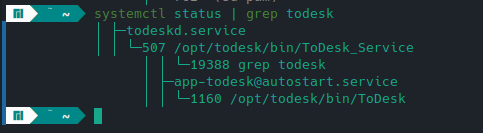​

```
    ~  systemctl status | grep todesk                                                                                                      ✔  11s  
           │ ├─todeskd.service
           │ │ └─507 /opt/todesk/bin/ToDesk_Service
                 │ │ └─19388 grep todesk
                 │ ├─app-todesk@autostart.service
                 │ │ └─1160 /opt/todesk/bin/ToDesk
```

每一个 Unit 都有一个配置文件，告诉 Systemd 怎么启动这个 Unit 。Systemd 默认从目录`/etc/systemd/system/`​读取配置文件。但是，里面存放的大部分文件都是符号链接，指向目录`/usr/lib/systemd/system/`​，真正的配置文件存放在那个目录。​`systemctl enable`​命令用于在上面两个目录之间，建立符号链接关系。

可以将`/etc/systemd/system/`​看作是自动目录，和`~/.config/autostart`​目录作用的形式差不多，只要是这个文件夹中的脚本就会自动运行。因此需要将真实的脚本链接到这个文件夹中。

详细的关于systemd的介绍参考：[Systemd 入门教程：命令篇](http://www.ruanyifeng.com/blog/2016/03/systemd-tutorial-commands.html)

参考链接：[Manjaro开机自启动脚本实现](https://github.com/MregXN/blogs/issues/2)

## 修改KDE的Applications Menu

我使用的是KDE桌面系统的Manjaro，在安装软件时，会创建desktop文件，用于快速启动应用。这个文件会放在`/home/ling/.local/share/applications`​下，更多的是放在`/home/ling/.local/share/applications`​中，wine的程序比较特殊，被放在了文件夹wine中。但我们不需要掌握这一套规则，可以直接使用GUI程序对菜单进行修改。

右键菜单图标，选择编辑应用（Edit Applications...）

​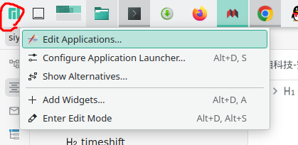

进入到编辑菜单栏后，就可以按照需求，拖动应用程序，或者新增对应的destop文件即可。

​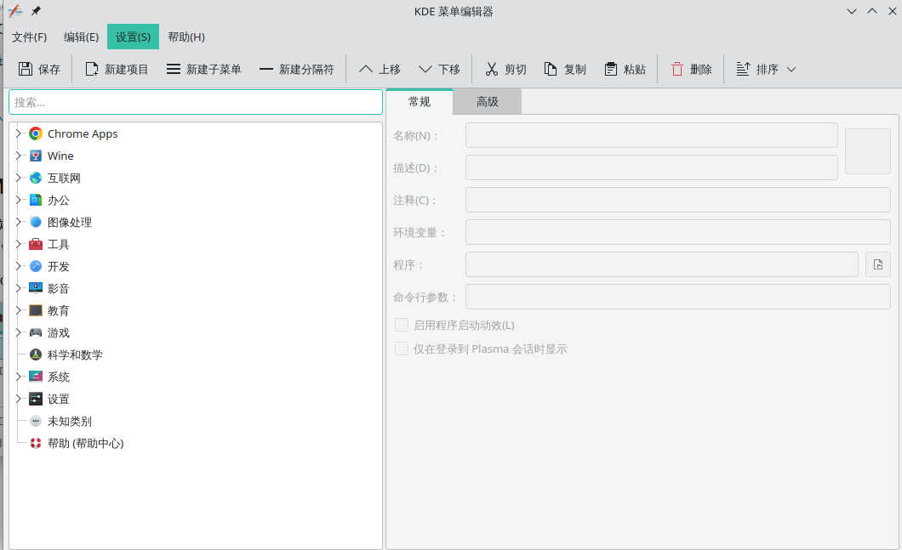​

‍

# 更换主题

## 在主题商店中安装全局主题

kde桌面有很强的定制性，可以在主题商店中安装各种各样的主题。但目前这个版本的kde（KDE 5.109.0 / Plasma 5.27.7），在安装全局主题时，会有如下报错：

​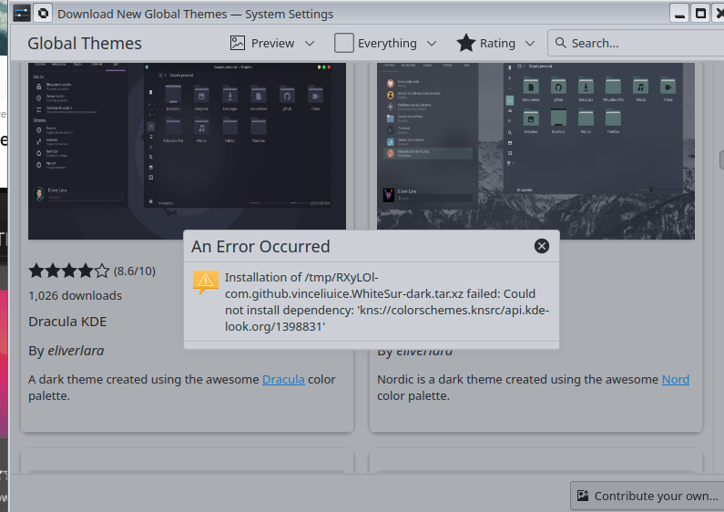​

上述问题提示是由于依赖问题导致的安装失败，而网络上的大部分帖子都提到这这是kde的官方仓库问题。还有推荐`ocs-url`​进行安装主题的，但是这种方式要求在网页下载，并且会等待10秒才能进行下载安装。而`ocs-url`​已经过时，使用该方式安装得到的主题大多不包含主题布局，仅仅只有一些开机界面，图标之类的残缺品。下图就展示有主题布局的和通过`ocs-url`​安装的没有桌面布局的主题。

​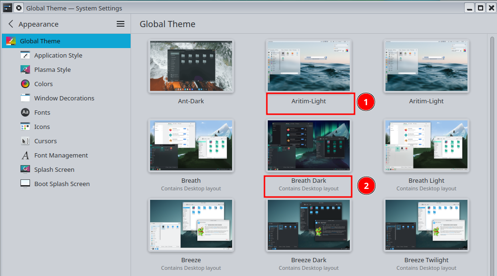​

由于是依赖问题报错，怀疑是仓库被ban导致连接不上仓库，无法下载文件。因此使用科学上网，然后再安装，但仍然有相同问题。在写这篇记录的时候，想对该问题截图，但意外的安装成功了。因此怀疑是代理不稳定。而在Fedora论坛中，发现有如下回答，可以通过命令行方式安装主题压缩包，由于命令行可以直观的观察进度，以及出现问题的原因，因此进行尝试。

参考链接：[Fedora Kinoite Global Theme Installation Problem](https://discussion.fedoraproject.org/t/fedora-kinoite-global-theme-installation-problem/73736)

​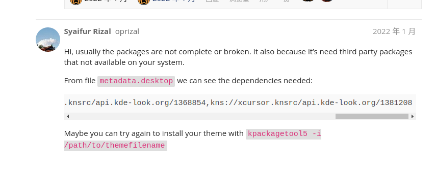​

结果，通过多次安装，竟然安装成功。因此，可以肯定该问题是由于网络问题导致的，而通过gui形式安装需要的时间较长，也不能直观的看出问题，因此少次尝试将不会成功。

​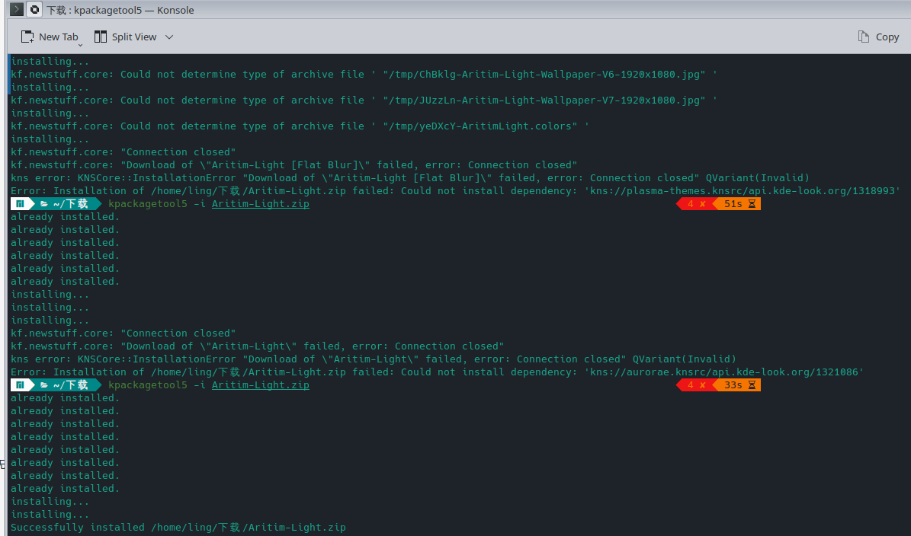​

可以从上图，看出，前几次安装都会失败，但每一次安装，都会有更多的安装包被安装，仅剩下少量的包依赖没有被下载。直到所有的安装包都被成功安装。

安装命令行如下：`kpackagetool5 -i /path/to/theme/file`​

示例：`kpackagetool5 -i com.github.vinceliuice.WhiteSur-dark.tar.xz`​

## 保证成功的安装某一主题的流程

1. 先在主题商店中查找自己喜欢的主题

​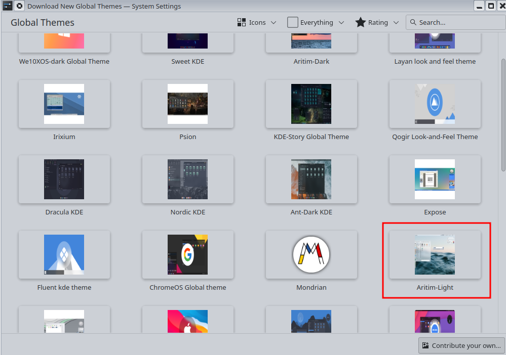​

2. 点击主题进入详情界面

    ​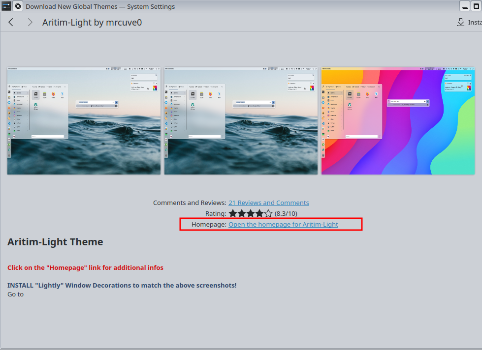​
3. 点击2中的红框部分的链接，通过网页打开该主题的下载界面，然后下载

    ​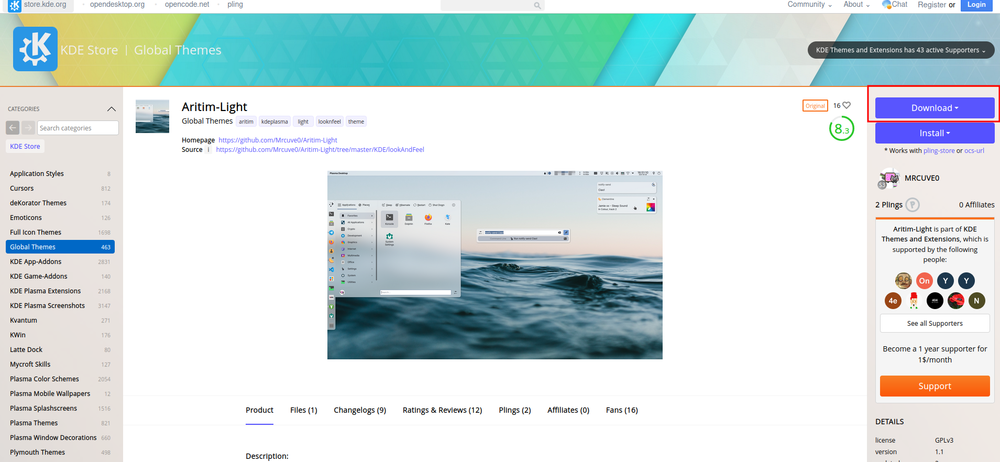​

    **注意：不要点到**​`install`​​**，**​`install`​​**是通过ocs-url下载安装的。**
4. 下载到本地后，在下载文件夹中打开终端，运行安装命令

    ​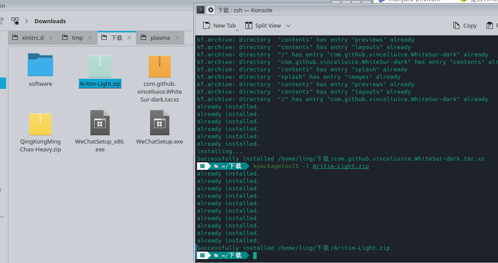​

    这个主题本身没有桌面布局，所以一次就安装成功了。像其他有桌面布局的主题，安装包大概都在1M多，没有布局的通常只有几百k。有布局的安装一次通常不会成功，需要在科学上网的情况下，多安装几次，如下：

    ​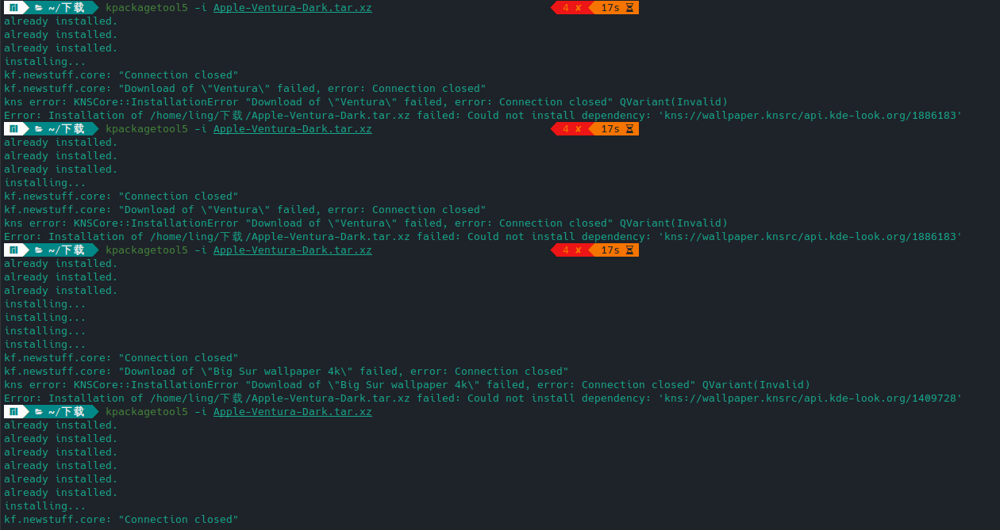​

    可以看到，在多安装几次以后，已经成功下载了一些之前没有下载成功的包，并进行了安装。如果多次不成功，则检查科学上网是否有问题。一般的情况需要尝试10次以内，依赖多的主题就需要尝试很多次了，例如下面图片中的主题安装

    ​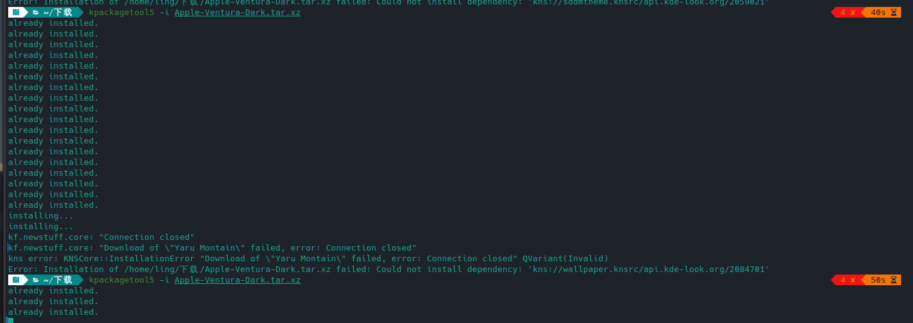​

    最终尝试了大概20多次，安装成功

    ​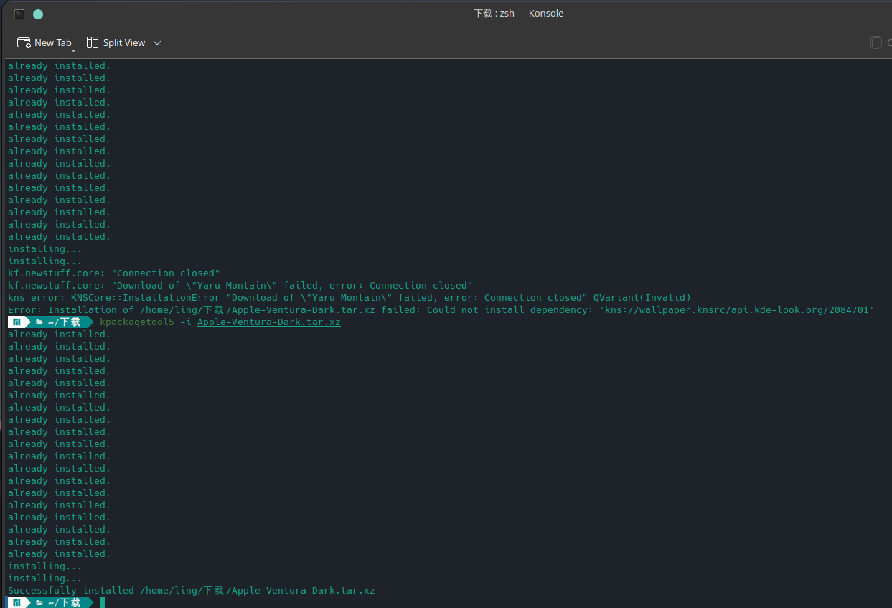​

## 最终美化效果

​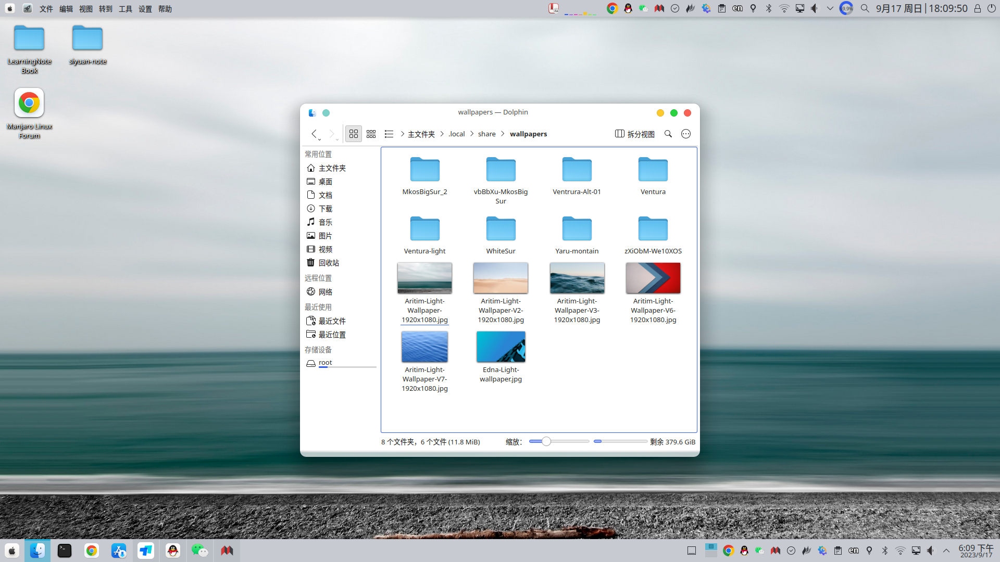​

# 独立显卡笔记本切换GPU，以支持外接显示器

参考链接：[Manjaro(kde) 安装nvidia显卡驱动（optimus-manager管理）](https://blog.csdn.net/viilike/article/details/128569907)

## 安装nivida驱动

首先进入设置界面，选中**硬件设定**，默认安装的很可能是第一个，这里先右键卸载当前驱动，然后安装有版本号的最新驱动。安装成功需要重启生效。

​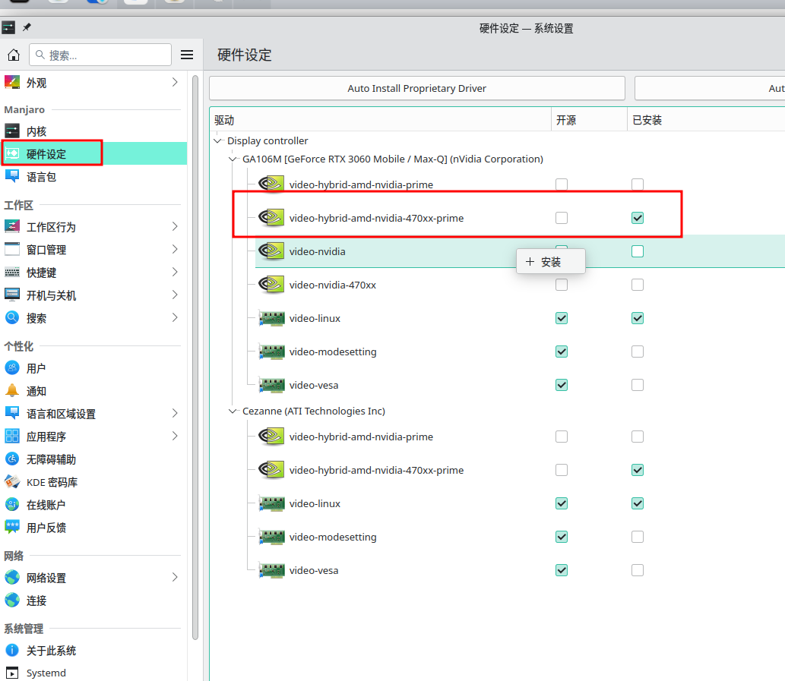​

在安装Manjaro时，会自动安装驱动，~~但经过实践，自动安装的驱动不能正常使用（表现为：外界显示屏仅显示manjaro的开机界面，而不显示桌面内容）~~。

~~因此需要在设置中安装新的驱动。~~此问题被修正，见2023.9.9日修正

## 开机扩展屏不进入桌面问题

2023.9.26日修正：

在后续的使用过程中，电脑启动时总是会出现`Failed to start Virtual Console Setup.`​问题，这个问题会导致tty1启动失败，外接电脑会一直显示启动界面，而不进入桌面应该是这个问题导致的。这个问题是由于`/etc/vconsole.conf ​`​配置文件中对键盘的`KEYMAP`​设置错误导致的，默认的`KEYMAP`​为`us`​，但现在变成了`cn`​。在之前配置输入法的时候，修改键盘布局为汉语，由于是在设置的GUI界面更改的，不清楚修改了哪些地方，现在看来也对`/etc/vconsole.conf`​进行了修改。

通过下列命令打开配置文件

```shell
sudo nano /etc/vconsole.conf 
```

修改其`KEYMAP`​，原来为cn,修改为us。可能会有`FONT`​等字段，直接删除就可（注意在文件的最后留一个空行），因为有默认值，直接删除不会影响配置。修改完成后如下：

​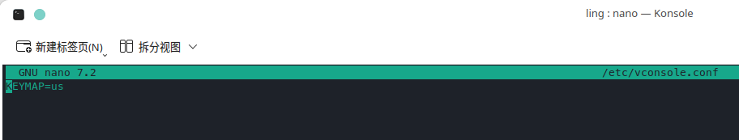​

2023.9.19日修正：该问题的原因（原因之一）是由于在Optimus中的PCI功耗控制没有**正确设置导致的**。经过反复的尝试，当开启PCI功耗控制时，开机启动可以正常扩展第二屏幕（我的独显是直连到输出接口）。否则第二屏幕将会一直显示启动界面tty1，并且该桌面是一个虚拟桌面，快捷键`ctrl+alt+F1`​可以切换当前桌面到tty1（默认桌面为tty2，可以通过快捷键`ctrl+alt+F2`​切换到tty2）。而且，由于Optimus Qt的设置逻辑有一定问题，如果PCI控制选中，即使按钮变灰，PCI功耗控制仍然有效，如下图：

​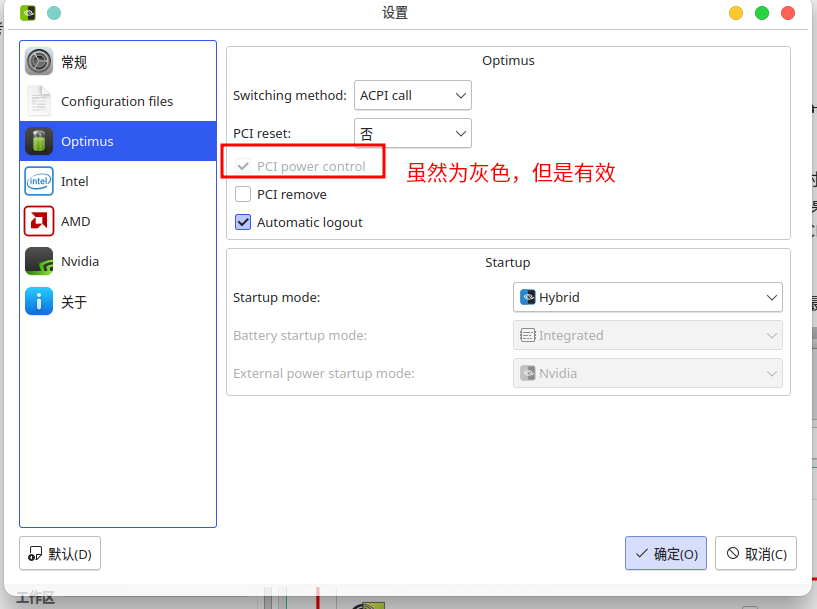

​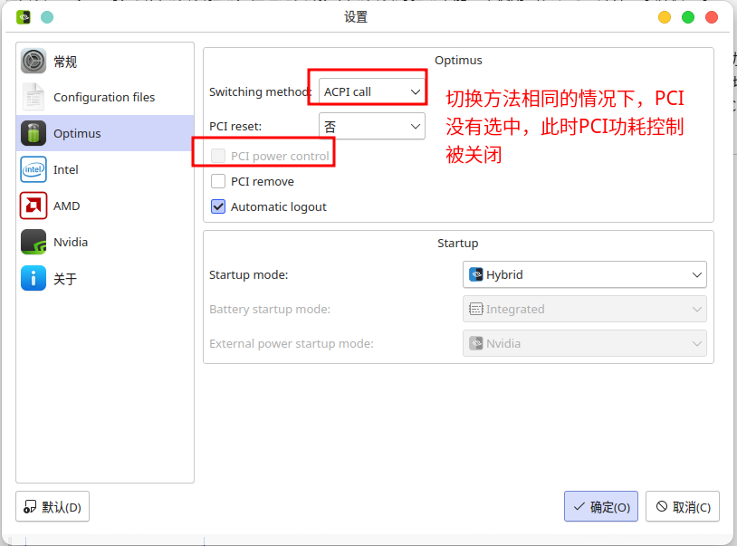​​

其他的switch选项有一些是可以改变PCI功耗控制的，因此，如果你的PCI功耗控制没有选中，并出现了上述问题，则可以先切换到其他选项，勾选`PCI power contol`​​，然后再切换到相应的模式。我的电脑在任何模式下都工作，但官方文档中提到，有一些显卡并不能都正常工作，需要自己进行尝试。

**注意：不要勾选**​`PCI reset`​**，会导致机器经常卡死屏幕键盘大小写等完全没反应，或者重启！**

## 修改文件sddm.conf

```shell
kate /etc/sddm.conf
```

找到x11,把这两项注释掉

```shell
[X11]
#DisplayCommand=/usr/share/sddm/scripts/Xsetup
#DisplayStopCommand=/usr/share/sddm/scripts/Xstop
```

​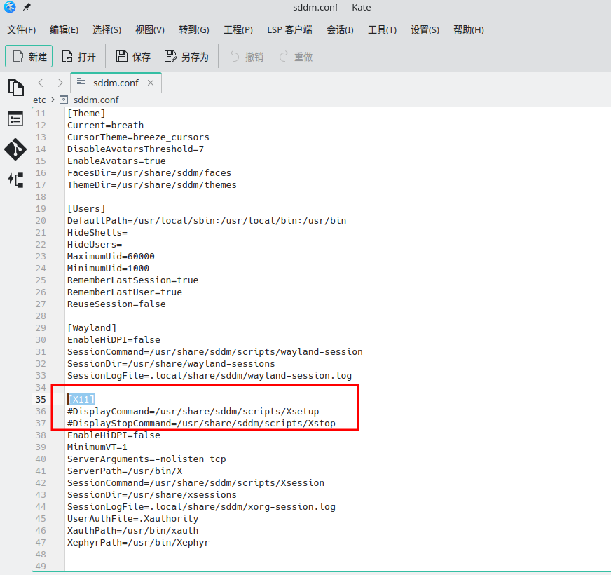​

## 安装optimus-manager管理软件

```shell
yay -S optimus-manager optimus-manager-qt
```

安装完成后，开启对应的服务，并设置为开机自启

```shell
systemctl start optimus-manager.service
systemctl enable optimus-manager.service
```

重启后，进行显卡模式切换，一般切换为Hybird，意为混合模式，在连接显示屏时启动独显（图中没有开启PCI power control，这导致了我在上面提到的开机扩展屏不进入桌面的问题）

2023.9.29更正：使用ACPI call会导致概率性卡死，可能是底层不支持某一些指令，因为厂商不会实现所有的API。改为开源驱动Nouveau，测试下来，使用Nouveau比较稳定，没有出现突然卡死的情况。

‍

​​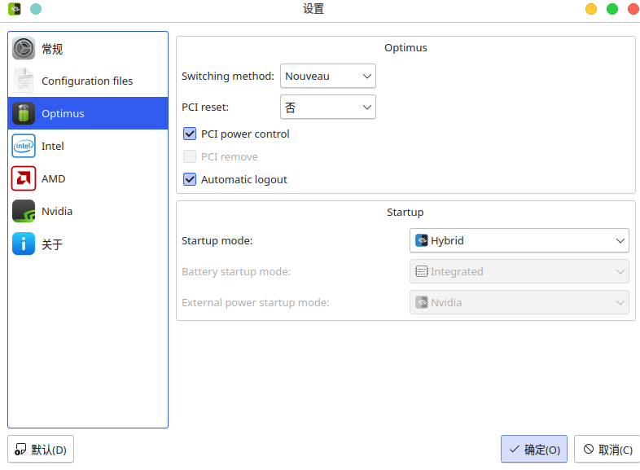​​

​​

其中swiching mode不用更改。若需更改，请参考官方文档：[optimus-manager 中的电源管理选项指南](https://github.com/Askannz/optimus-manager/wiki/A-guide--to-power-management-options)

## 双屏分辨率缩放问题

对与该问题，目前在kde中没有完美的解决方案，唯一的一种方式是通过将要缩小的显示器虚拟一个较高的分辨率，并渲染较高分辨率的画面，然后根据比例缩小到物理分辨率。

参考链接：[KDE 双高分辨率显示器不同 DPI 缩放比例](https://zhuanlan.zhihu.com/p/636626088)。

这种方式我只对其在X11下的工具进行了使用，并没有完全按照其计算方式进行设置，但很遗憾，在我的电脑并不能正常工作。无论是修改~/.config/kdeglobals文件还是通过`xrandr`​​进行配置，都无法正常工作。

# 一行安装

```shell
yay -S qqmusic-bin visual-studio-code-bin clion java-runtime clion-jre flameshot cmake make linuxqq siyuan-note-bin google-chrome watt-toolkit-bin clash clash-for-windows-bin todesk-bin
```

# 最后附上一位博主2022的安装笔记

链接：[manjaro踩坑记(2022更新版)](https://mrswolf.github.io/my-manjaro-log/)

只使用了其中的windows字体安装，这部分，如果早点看到，那么微信字体的bug就不会费那么大劲了。另，其中提到到的SSD优化，目前的版本已经默认开启。

下面是该网页的保存文件，只在Chrome上测试过，可以打开。[manjaro踩坑记2022更新版_swolf的博客.mhtml](assets/manjaro踩坑记2022更新版_swolf的博客-20230919165124-ar99mvr.mhtml)。mhtml格式是单个文件。

# 网易云音乐卡bug安装

```shell
yay -S dh-autoreconf # manjaro下需要手动安装deepin的依赖
yay -S deepin-wine-wechat # deepin版本的微信
sudo pacman -S wine-for-wechat
yay -S com.qq.weixin.spark # 微信
wine NeteaseCloudMusic_Music_official_2.10.12.201849_32.exe # 网易云音乐，NeteaseCloudMusic_Music_official_2.10.12.201849_32.exe是在官网下载的windows安装包
```

deepin的wine有原装的gdiplus库，但只安装deepin的wechat，没有给wine程序，因此无法通过命令行安装网易云音乐。因此需要安装wine-for-wechat，提供wine命令。这一步其实没有安装新的wine。然后就可以直接安装网易云的包，就可以正常运行网易云！甚至能使用桌面歌词！

​​

‍
