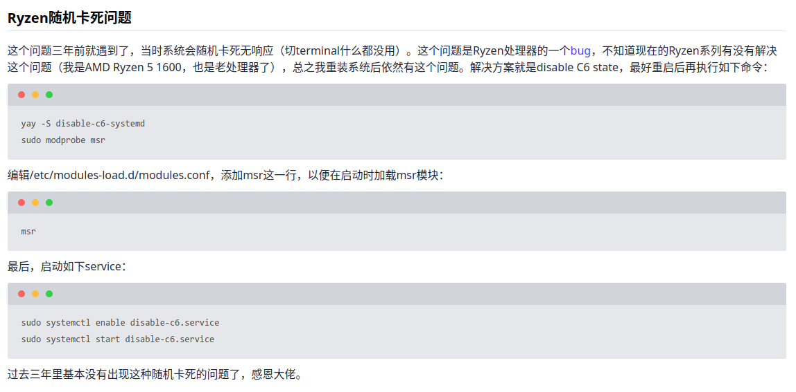
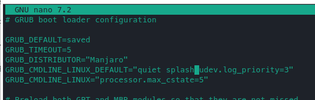

现象：浏览网页，编写文字等正常工作时，会突然卡死，屏幕显示内容不动，鼠标无法移动，键盘没有反应（按下大小写键，大写提示灯不会改变）。且完全随机 ，跟打开软件没有关系。最开始怀疑是Nvidia的显卡驱动问题，但没有找到任何解决方案。因此尝试下面这个方案：[Ryzen随机卡死问题](https://mrswolf.github.io/my-manjaro-log/#Ryzen%E9%9A%8F%E6%9C%BA%E5%8D%A1%E6%AD%BB%E9%97%AE%E9%A2%98)、[解决方案原git仓库](https://github.com/jfredrickson/disable-c6)

原博主内容截图：

​​

根据其中的描述

先安装守护进程服务软件

```shell
yay -S disable-c6-systemd
sudo modprobe msr
```

编辑/etc/modules-load.d/modules.conf，添加msr这一行，以便在启动时加载msr模块：

```shell
msr
```

最后，启动如下service，完成上述操作完成后，推荐重启电脑后才能启动。

```shell
sudo systemctl enable disable-c6.service
sudo systemctl start disable-c6.service
```

如果报错，就在重启后重新安装一下，再开service。

​​

另，根据在Manjaro中的讨论，有人在Archlinux的wiki中也找到了同样的问题描述，称之为 [Soft lock freezing](https://wiki.archlinux.org/title/Ryzen) 。根据其解决方案的描述，提供了四种方案：

1. 关闭rcu。考虑到需要编译内核，比较麻烦，大多数情况下不会尝试。

    当`Kernel >= 4.10.0`​，编译内核时，追加参数`CONFIG_RCU_NOCB_CPU`​进行编译。将`echo rcu_nocbs=0-$(($(nproc)-1))`​的结果，添加到grub的`GRUB_CMDLINE_LINUX`​中。
2. 关闭c6 state

    kernel参数追加`processor.max_cstate=5`​：在grub的`GRUB_CMDLINE_LINUX`​中添加`processor.max_cstate=5processor.max_cstate=5`​

    ```shell
    sudo nano /etc/default/grub
    ```

    ​​

    保存后，还要运行`sudo update-grub`​以更新grub。

    但这个方法有可能不能正确关闭c6状态，此时就需要本文提到的方法，使用`disable-c6-systemd`​进行关闭。该方法在我的电脑上不可行的，因此我通过`disable-c6-systemd`​进行关闭。
3. 某一些笔记本中（例如HP Envy x360 15-bq100na），可能存在CPU软件锁定的问题，通过在kernel中追加参数`idle=nomwait`​，可以避免。
4. kernel参数追加`pci=nomsi`​，这个办法我尝试过，但不起作用，仍然会冻结。尝试：`acpi_osi=Linux`​加入的到kernel参数或许有用(我增加这个参数后，仍然会死机，但相较于之前概率小很多)。

补充：这个问题所有的AMD的Ryzen处理器都会遇到！根据 [Bug 196683 - Random Soft Lockup on new Ryzen build](https://bugzilla.kernel.org/show_bug.cgi?id=196683) 这个帖子中的讨论，从2017年就开始存在，一直到现在都没有修复，我使用的是 R7 5800H，甚至在windows下，都有一定概率发生。因此，AMD真的不能yes，下一台笔记本还是intel算了。AMD虽然整体性能已经追上来了，但仍然有一些小问题，虽然不致命，但很让人心烦。希望这个帖子可以帮助你解决问题！

‍

2023/10/13 更新

最近的卡死概率降低了很多，但是在半夜仍然会卡死，看来通过软件在开机启动的时候关闭C6不能完全解决这个问题。

又通过一些搜索，找到了下面的文章：[ADM Ryzon处理器随机”冻结”问题](https://cloud-atlas.readthedocs.io/zh_CN/latest/kernel/cpu/amd/amd_cpu_c-state.html)、[AMD Ryzen CPU 随机“冻结”](https://gist.github.com/dlqqq/876d74d030f80dc899fc58a244b72df0)、[AMD Ryzen 2700X + CentOS7 隨機鎖死問題](https://blog.udn.com/wldtw2008/118678592)

根据其中的各种描述，解决方法如下：

1. 如果你的BIOS支持关闭CPU电源管理，则需要在BIOS中关闭。
2. 在内核参数中增加​`idle=nomwait`​
3. 在内核参数中增加​`processor.max_cstate=1 intel_idle.max_cstate=0`​
4. 内核参数更新后，需要手动执行`sudo update-grub`​以更新配置

通过下列命令查看`max_cstate`​，没有更改之前其值为9。

```shell
cat /sys/module/intel_idle/parameters/max_cstate
```

通过`cat /proc/cmdline`​可以查看内核启动参数。
