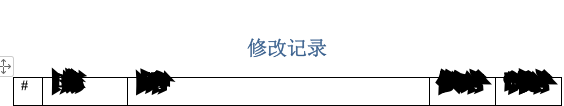
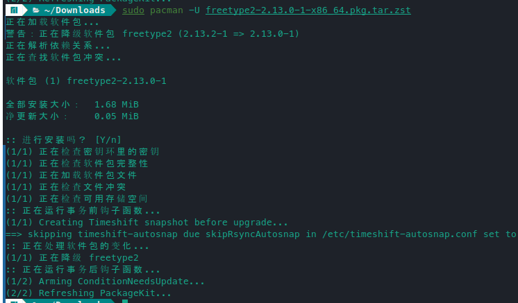

解决方案：[Wps很多字体的加粗都显示异常的问题](https://forum.manjaro.org/t/wps/144447)。如图：

​​

降级 freetype2 (2.13.2-1 → 2.13.0-1) 即可解决问题

如果是更新包后，出现问题，则系统应该会保留旧包的缓存，可以直接执行

```sh
sudo pacman -U /var/cache/pacman/pkg/freetype2-2.13.0-1-x86_64.pkg.tar.zst
```

如果提示包不存在，则说明缓存被清理，或者以前没有安装过旧版。

​​

需要去官方备份下载旧版本，再使用上述命令行手动安装。官方备份网站：[归档](https://archive.archlinux.org/)

​​

‍
