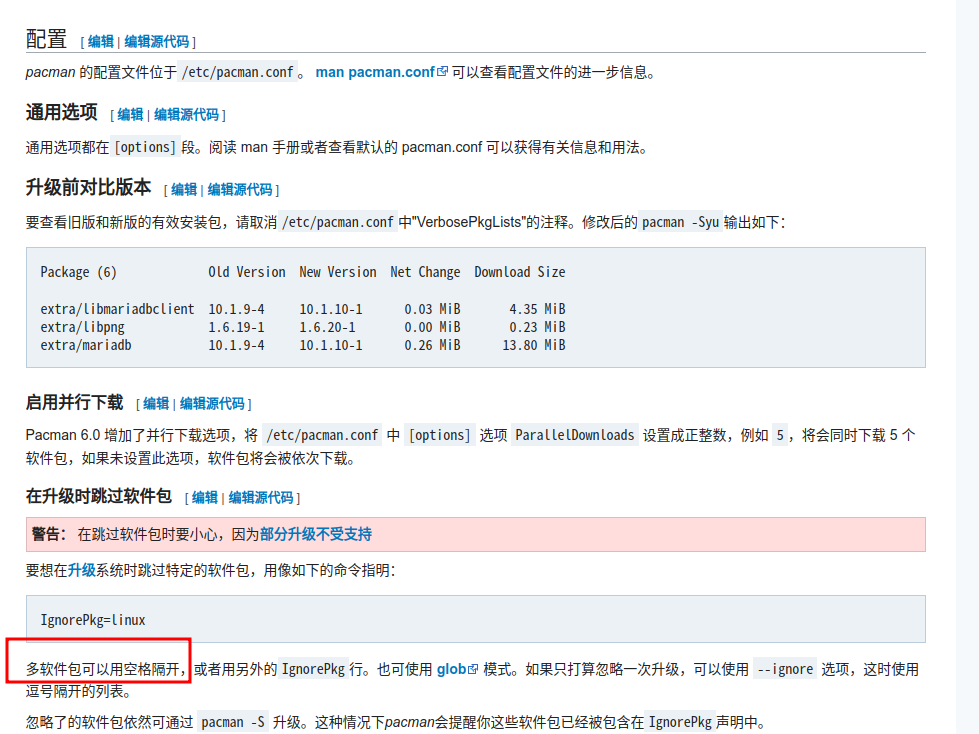

参考链接：[降级软件包](https://wiki.archlinuxcn.org/wiki/%E9%99%8D%E7%BA%A7%E8%BD%AF%E4%BB%B6%E5%8C%85)

# 使用pacman的临时文件

如果一个新包刚刚被安装并且没有删除[pacman cache](https://wiki.archlinuxcn.org/wiki/Pacman#Cleaning_the_package_cache "Pacman"),你可以在`/var/cache/pacman/pkg/`​中找到较早版本. 安装替换现有的版本.[pacman](https://wiki.archlinuxcn.org/wiki/Pacman "Pacman")会处理依赖包但不会处理依赖库的版本冲突。如果一个其依赖库因该包降级需要降级，你需要手动降级这些包。

```
 # pacman -U /var/cache/pacman/pkg/package-old_version.pkg.tar.type
```

对老的软件包，`type`​ 应该是 `xz`​，遵循 [2020 变更](https://archlinux.org/news/now-using-zstandard-instead-of-xz-for-package-compression/)的新软件包，`type`​ 应该是 `zst`​。

当成功降级该包以后，请**暂时将其加入**​`**pacman.conf**`​​​的[IgnorePkg section](https://wiki.archlinuxcn.org/wiki/Pacman#Skip_package_from_being_upgraded "Pacman")，直到您的问题被解决。

使用nano编辑文件/etc/pacman.conf，找到其中的IgnorePKG字段，按照下图将降级包加入到配置中。

​​

如果本地没有旧版本的cache，或者是被清理了，则需要去Arch Linux Archive下载旧版本的包，然后重复上述操作。

## Arch Linux Archive

[Arch Linux Archive](https://wiki.archlinuxcn.org/wiki/Arch_Linux_Archive "Arch Linux Archive")是[official repositories](https://wiki.archlinuxcn.org/wiki/Official_repositories "Official repositories")的日更快照。

*ALA*能被用来降级包或者还原整个系统到过去版本。

网站链接：[归档](https://archive.archlinux.org/)

# 自动化

**downgrade** — 基于Bash使用本地缓存和[Arch Rollback Machine](https://wiki.archlinuxcn.org/wzh/index.php?title=Arch_Rollback_Machine&action=edit&redlink=1 "Arch Rollback Machine（页面不存在）")。详见**downgrade(8)**。

[https://github.com/pbrisbin/downgrade](https://github.com/pbrisbin/downgrade) || [downgrade](https://aur.archlinux.org/packages/downgrade/)​^AUR^

‍
