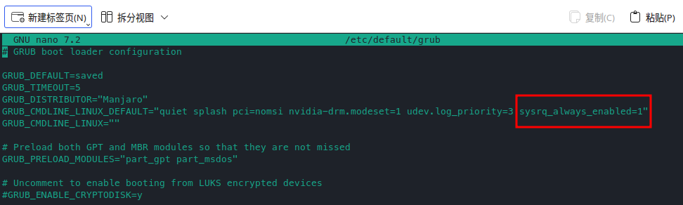

当系统死机，没有响应（freezes），需要重启时，大多数人使用的方法是长按电源按钮进行硬关机，这样会导致系统数据丢失，严重情况下甚至会损坏系统。但在linux内核中，有一个特殊的按键：SysRq（**Sys** tem **R** e **q** uest key）。如果激活SysRq键，就可以输入一些特殊的系统操作命令，用于在系统崩溃时进行一些操作（同步数据、杀进程、卸载文件系统，甚至系统重启）。可以安全的重启系统。

参考：[linux 中的 SysRq 魔术键](https://rqsir.github.io/2019/05/02/linux%E4%B8%AD%E7%9A%84SysRq%E9%AD%94%E6%9C%AF%E9%94%AE/)

# [SysRq](https://en.wikipedia.org/wiki/Magic_SysRq_key) 键

在 QWERT 的全尺寸键盘上与 `PrtSc`​ 同键，并且会在按键上标注有SysRq。使用`Alt`​+`PrtSc`​激活`SysRq`​。

在一些笔记本上虽然没有标注，但可以通过`Fn`​+`Alt`​+`PrtSc`​组合键的方式激活SysRq按键。

如果上面的组合都不起作用，则可以尝试下面几种：

* ​`Alt`​+`PrtSc`​
* ​`Alt Gr`​+`PrtSc`​
* ​`Ctrl`​+`Alt`​+`PrtSc`​

注意，激活`SysRq`​后，需要保持`Alt`​按键按下，并松开`SysRq`​或​`PrtSc`​

**请阅读完后续内容再尝试，并在尝试之前保存所有工作内容！**

# REISUB

参考：[[HowTo] reboot / turn off your frozen computer: REISUB/REISUO](https://forum.manjaro.org/t/howto-reboot-turn-off-your-frozen-computer-reisub-reisuo/3855/104?page=2)

**REISUB**是 **R** eboot **E** ven **I** f **S** ystem **U** tterly **B** roken 的SysRq命令的助记符。表示 **即使系统完全崩溃也能重启**。

激活SysRq按键后，在键盘上按下如下按键，就可以优雅的重启系统：

* Switch the keyboard from **R** aw mode, used by programs such as [X11 ](https://en.wikipedia.org/wiki/X11)​[**112**](https://en.wikipedia.org/wiki/X11) and [SVGALib ](https://en.wikipedia.org/wiki/SVGALib)​[**25**](https://en.wikipedia.org/wiki/SVGALib), to XLATE (translate) mode
* Send an **E** nd signal (SIGTERM) to all processes, except the boot process, allowing all processes to end gracefully
* Send an **I** nstant kill (SIGKILL) to all processes, except the boot process, [*forcing*](https://archived.forum.manjaro.org/uploads/short-url/cnLk0cUdRVTCXdbIvFEXpWqbpBb.jpeg)​[ all processes to end ](https://archived.forum.manjaro.org/uploads/short-url/cnLk0cUdRVTCXdbIvFEXpWqbpBb.jpeg)​[**43**](https://archived.forum.manjaro.org/uploads/short-url/cnLk0cUdRVTCXdbIvFEXpWqbpBb.jpeg) .
* **S** ync all mounted filesystems, allowing them to write all data to disk.
* **U** nmount and remount all mounted filesystems in [read-only ](https://en.wikipedia.org/wiki/File_system_permissions)​[**8**](https://en.wikipedia.org/wiki/File_system_permissions) mode.
* Re **B** oot the system

下面是上述英文的中文解释

```shell
R - 把键盘设置为 ASCII 模式 (用于接收后面键盘输入)
	SysRq: Keyboard mode set to XLATE

E - 向除 init 以外所有进程发送 SIGTERM 信号 (让进程自己正常退出)
	SysRq: Terminate All Tasks

I - 向除 init 以外所有进程发送 SIGKILL 信号 (强制结束进程)
	SysRq: Kill All Tasks

S - 磁盘缓冲区同步
	SysRq : Emergency Sync

U - 重新挂载为只读模式
	SysRq : Emergency Remount R/O

B - 立即重启系统
	SysRq: Resetting
```

由于系统环境与后台进程个数的不确定性，每一步按键操作执行完成所费时间无法确定。为保险起见，一般采用 **R – 1 秒 – E – 30 秒 – I – 10 秒 – S – 5 秒 – U – 5 秒 – B，而不是一气呵成地按下这六个键**。

# 用法

如果按照上述方法，并没有左右，则可能是`SysRq`​功能没有启用。

## 启用 SysRq 功能

首先检查 `SysRq`​ 是否开启

```shell
cat /proc/sys/kernel/sysrq
```

若输出为 0，则还未开启。

在manjaro中，通过向grub写入配置命令启用Linux的SysRq功能。

向文件`/etc/default/grub`​中的`GRUB_CMDLINE_LINUX_DEFAULT`​参数添加： `sysrq_always_enabled=1`​

```shell
sudo nano /etc/default/grub
```

更改完后记得`ctrl`​+`O`​保存文件。

​​

然后执行

```shell
sudo update-grub
```

更新grub。最后重启系统。

## 实际使用过程

先激活`SysRq`​按键，全键盘：`Alt`​+`SysRq`​，笔记本：`Fn`​+`Alt`​+`PrtSc`​。激活后保持`Alt`​按键按下，松开`PrtSc`​或者`SysRq`​。

根据电脑的性能不同，激活时间不一样。新硬件可能在1秒，旧的硬件可能在6秒。

激活后，在键盘上按照R E I S U B的顺序，就可以安全的重启系统，需要注意根据上述介绍，一般采用 **R – 1 秒 – E – 30 秒 – I – 10 秒 – S – 5 秒 – U – 5 秒 – B，而不是一气呵成地按下这六个键**。

‍
