[Hugo PaperMod](https://github.com/adityatelange/hugo-PaperMod/) 是基于 [hugo-paper](https://github.com/nanxiaobei/hugo-paper) 的一个主题。基于其可以快速搭建一个博客网站。这是利用框架搭建的一个example，介绍其安装和搭建过程：[hugo-PaperMod - Installation](https://adityatelange.github.io/hugo-PaperMod/posts/papermod/papermod-installation/)。

在普通搭建以及在GITHUB上搭建参考：[hugo博客搭建 | PaperMod主题](https://www.sulvblog.cn/posts/blog/build_hugo/)；[利用 Hugo 和 Github Pages 创建静态博客并实现自动部署](https://www.yuweihung.com/posts/2021/hugo-github-pages-blog/)

hugo官方文档中文版：[Hugo静态网站建站手册](https://www.wmxliu.cn/archives/hugo/)

网络上关于搭建博客的文章很多，但是很多都只是简单的搭建，没有说清楚搭建以后，应该怎么用，建立新文章怎么管理内容，怎么将图片放在文章之中。如果要对文章进行分类，应该如何做。

# Hugo 快速上手

## 创建网站

本文档在Manjaro系统下操作。

首先需要安装一些依赖软件：`go`​​ `hugo`​​ ​`dart-sass`​​

参考链接：[manjaro go环境搭建](https://flynx.dev/post/manjaro_go_env_2021/)、[PaperMod Installation](https://github.com/adityatelange/hugo-PaperMod/wiki/Installation)

```shell
sudo pacman -S go
sudo pacman -S hugo
sudo pacman -S dart-sass
```

首先使用hugo建立一个新网站：[quick-start](https://gohugo.io/getting-started/quick-start/)。需要注意的是，Hugo PaperMod推荐使用的配置文件格式是yml，因此需要使用 -f 指定为yml。

```shell
hugo new site <name of site> -f yml
```

但是指定以后在目录下自动创建的配置文件的格式仍然是toml，需要手动更改为yml。并且其默认名称也从config.toml变成了现在的hogo.toml。

## 下载主题

这一步需要下载主题到本地。然后按照配置文件，修改其中的配置，以符合自己的想法，然后在配置中选中主题。

[hugo主题官网](https://themes.gohugo.io/)中有很多主题，我选择PaperMod。点击下载，进入主题github界面，然后通过submodule的方式将主题添加到blog网站站点的文件夹的themes目录。

submodule的好处是便于更新。当下载完主题后，将主题的assets、i18n、layouts目录复制到网站目录下。后续修改直接在网站目录下修改即可。参考 [PaperMod Installation](https://github.com/adityatelange/hugo-PaperMod/wiki/Installation) 中的方法2.

​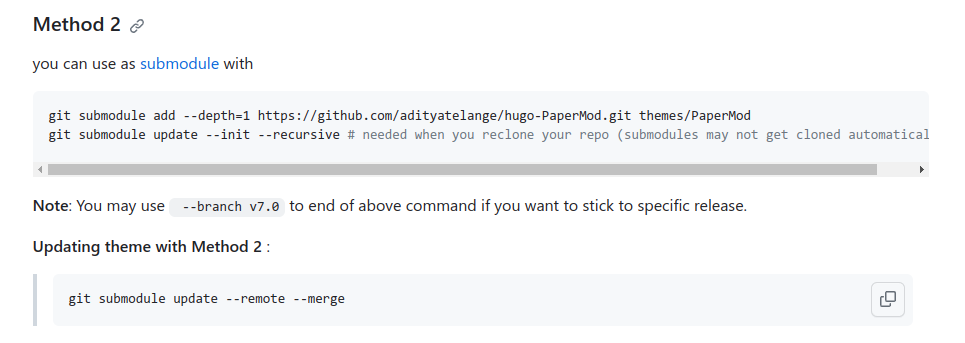​

完成的目录

​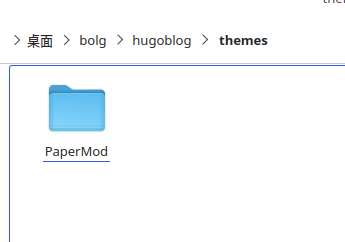​

​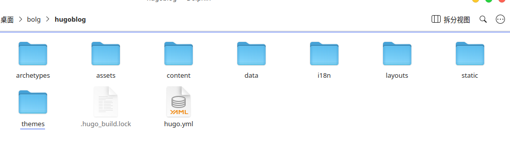​

当新电脑需要clone时，加入下列参数，可以直接连submdules一起下载。

```git
git clone username.github.io --recurse-submodules
```

### 站点目录介绍

quickstart/  
├── archetypes/  
│   └── default.md # 指明新生成的页面默认的头部注释  
├── assets/ # 存储所有需要由 Hugo Pipes 处理的文件。只有使用了 .Permalink 或 .RelPermalink 的文件才会发布到public 目录  
├── config/ # 默认情况下不会创建。存储 yaml、toml、json 文件，几乎不用配置，但是 Hugo 提供了配置指令  
├── content/ # 网站的所有内容都将位于此目录中。content 下的顶级文件夹表示分类  
├── data/ # 存储Hugo在生成网站时可以使用的配置文件。也可以创建从动态内容中提取的数据模板  
├── layouts/ # 以 .html 文件的形式存储模板，指定如何将内容视图呈现到静态网站中  
├── public/ # hugo 命令生成的静态页面存储位置，用于正式发布  
├── static/ # 存储所有静态内容：图像、CSS、JavaScript等  
├── themes/ # 主题目录  
└── hogo.toml # 生成页面配置文件

### 配置主题

在配置文件hugo.yml中，将theme配置成主题文件夹的名称PaperMod。hugo有一套自己的配置参数，可以配置网站的显示效果，每个主题又有自己单独的一些配置参数，可以参考主题的介绍进行配置。这是hugo的配置介绍：[Configure Hugo](https://gohugo.io/getting-started/configuration/)，这是PaperMod的配置介绍：[Features](https://adityatelange.github.io/hugo-PaperMod/posts/papermod/papermod-features/)。

建议按照PaperMod的[sample-configyml](https://github.com/adityatelange/hugo-PaperMod/wiki/Installation#sample-configyml)进行配置，配置大概后，再根据需求进行更改。

​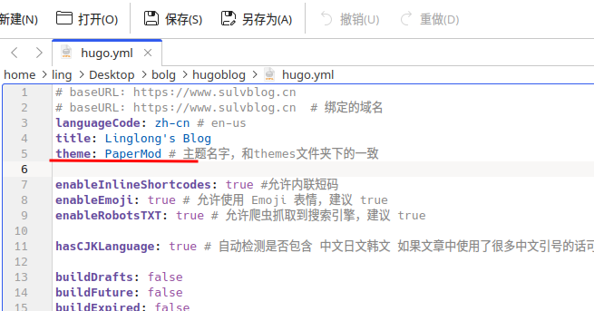​

在PaperMod主题的官方wiki中的[Features](https://adityatelange.github.io/hugo-PaperMod/posts/papermod/papermod-features/)部分，详细介绍了支持的几种模式（Regular Mode ，Home-Info Mode，Profile Mode）以及给了默认的一些界面（search（搜索界面），archives（记录时间线），tags（标签））。并给出了使用对应的特性的方法。

#### 例如使用Archives Layout，展示时间线

在 `content`​中建立新文件`archive.md`​ 

```shell
.
├── config.yml
├── content/
│   ├── archives.md   <--- Create archive.md here
│   └── posts/
├── static/
└── themes/
    └── PaperMod/
```

然后将下列内容放在文件中

```yaml
---
title: "Archive"
layout: "archives"
url: "/archives/"
summary: archives
---
```

layout字段表示使用主题自带的layout布局。

如果在hogo.yml的配置文件中，正确配置了菜单，并将archives的路径加入到菜单（如下），则可以在主页顶部看到导航栏中有时间轴，点击就可以看到建立文件的时间线。

```yaml
menu:
  main:
    - identifier: search
      name: 🔍搜索
      url: search
      weight: 1
    - identifier: home
      name: 🏠主页
      url: /
      weight: 2
    - identifier: posts
      name: 📚文章
      url: posts
      weight: 3
    - identifier: archives
      name: ⏱时间轴
      url: archives
      weight: 4
    - identifier: tags
      name: 🔖标签
      url: tags
      weight: 5
    - identifier: about
      name: 🙋🏻♂️关于
      url: about
      weight: 6
```

## 启动博客

配置完成后，在终端直接输入`hugo server -D`​，启动 Hogo server，然后在浏览器中打开`http://localhost:1313`​就可以在本地预览效果。

### hugo server的用法简介

根据官方网站的描述：[hugo server](https://gohugo.io/commands/hugo_server/)

​`hugo`​提供高性能的网络服务器功能，渲染的内容以及网站的内容被放在内存中而不是放在硬盘。hugo会监视硬盘中的文件，如果有任何改动，hugo会自动重新构建整个网站，并且重新加载。然后就能在浏览器中看到最新的更改。

​`hugo server`​的命令格式为

```shell
Usage:
  hugo server [command] [flags]
  hugo server [command]
```

Command仅有trust，用于安装证书，一般都不需要。只在后面跟各种flags，例如

```shell
hugo server -D
```

-D用于将标记为Drafts的content也进行build，然后放在website中进行显示。

# 添加文章到网站

hugo有一套管理内容的方式，称之为`page bundles`​。要了解如何将文章添加到网站，并对其进行有效的管理，才能有条理的添加文章到网站。

## page bundles

又被称作**页面解析**。`page bundles`​分为两种：

* Leaf Bundle (leaf means it has no children) 叶子目录
* Branch Bundle (home page, section, taxonomy terms, taxonomy list)集合目录

||叶子目录|集合目录|
| ----------------| ----------------------------------------| ------------------------------------------------------|
|用法|单个页面的内容和附件集合|章节页面的附件集合（主页、章节、分类术语、分类列表）|
|索引文件名|​`index.md`​|​`_index.md`​|
|允许的资源|页面（page）和非页面（如图像、PDF 等）|仅限非页面（如图像、PDF 等）|
|资源位置|叶子界面下包含的所有目录|仅`_index.md`​ 所在目录，不包含下级目录|
|布局类型|​`single`​|​`list`​|
|嵌套|不允许嵌套其他页面|允许在其下嵌套集合和页面|
|例|​`content/posts/test/index.md`​|​`content/posts/_index.md`​|
|非索引页面文件|仅作为页面资源访问|仅作为常规页面访问|

### Leaf Bundle

Leaf Bundle 是 content/ 目录中任何层次结构中的包含一个 index.md 文件的目录。叶子目录中不能再包含叶子目录，但不限制其本身的目录深度。

#### Examples of leaf bundle organization

```shell
content/
├── about # leaf bundle
│   ├── index.md
├── posts # leaf bundle
│   ├── my-post # leaf bundle
│   │   ├── content1.md
│   │   ├── content2.md
│   │   ├── image1.jpg
│   │   ├── image2.png
│   │   └── index.md
│   └── my-other-post # leaf bundle
│       └── index.md
│
└── another-section 
    ├── ..
    └── not-a-leaf-bundle
        ├── ..
        └── another-leaf-bundle # leaf bundle
            └── index.md
```

### branch Bundle

branch Bundle 是 content/ 目录中任何层次结构中的包含一个 _index.md 文件的目录。

#### Examples of branch bundle organization

```shell
content/
├── branch-bundle-1
│   ├── branch-content1.md
│   ├── branch-content2.md
│   ├── image1.jpg
│   ├── image2.png
│   └── _index.md
└── branch-bundle-2
    ├── _index.md
    └── a-leaf-bundle
        └── index.md
```

## 添加文章

根据上面的描述，Leaf Bundle适合单独的page，这个page中用到的图片，文档，音乐等资源可以整合到一起。Branch Bundle适合组合多个page的资源，可以理解为对Leaf Bundle的分类。英文名取的很形象，树枝上可以长出其他树枝，也可以长出叶子，但是叶子上不能有其他叶子，一片叶子就是一个page，一个树枝上能存在有很多叶子。

因此，使用Branch Bundle建立一个大类，比如：技术类，生活类。在其下，我们可以建立很多文章。浏览博客的人可以点击不同的类别，进入到该类中，然后才能浏览具体的文章。这样就实现了分类的功能。

### 建立一个类别

实际上，content文件夹本身就是一个Branch Bundle，是唯一一个不需要_index.md文件的Branch Bundle。为了便于管理文章，我们在content下建立一个posts文件夹，专门用于存放文章。那么posts也是一个Branch Bundle，需要建立_index.md表明这是一个Branch Bundle。否则就不会显示其中的下一级文件夹中的内容。在posts下，再建立新文件夹，表示一个单独的分类，在该文件夹中再建立_index.md文件，建立一个新Branch Bundl。如下图所示

```yaml
posts/
├── _index.md
├── learning
│   ├── _index.md
│   └── my-first-post.md
├── projects
│   └── _index.md
└── record
    └── _index.md
```

上面的示例代码有三个分类：learning，projects，record。my-first-post.md就是learning分类下的文章。

而_index.md中的内容，其实就是hugo中的front matter。用于控制md文件的显示格式的。一般_index.md文件的内容如下：

```yaml
---
title: "🧀我的项目"
description: "记录做过的项目"
weight: 3
author: ["ling"]
hidemeta: true # 是否隐藏文章的元信息，如发布日期、作者等
---
```

其中分割线`---`​使用表示内容的格式是yaml，hugo还支持tmol（`+++`​）和json（`{}`​）。weight定义了不同md的显示顺序。

### 新文章

由于hugo中的front matter可以控制文章的一些显示特性，每一次手动添加这些内容太麻烦了，因此hugo有一个default模板，当通过hugo的命令行添加新文档时就可以自动添加这部分内容。模板位置位于：./archetypes/default.md。

hugo的官方文档中给出了所有的[front-matter](https://gohugo.io/content-management/front-matter/)支持的变量。每一个主题可能有一些扩展的变量，例如：[PaperMod page-variables](https://github.com/adityatelange/hugo-PaperMod/wiki/Variables#page-variables)。

可以手动对其进行修改，下面是default.md的内容

```yaml
---
title: "{{ replace .Name "-" " " | title }}"
date: {{ .Date }}
lastmod: {{ .Date }}
author: ["Ling"]
keywords:
-
categories: # 没有分类界面可以不填写
-
tags: # 标签
-
description: ""
weight:
slug: ""
draft: true # 是否为草稿
comments: true # 本页面是否显示评论
reward: true # 打赏
mermaid: true #是否开启mermaid
showToc: true # 显示目录
TocOpen: true # 自动展开目录
hidemeta: false # 是否隐藏文章的元信息，如发布日期、作者等
disableShare: true # 底部不显示分享栏
showbreadcrumbs: true #顶部显示路径
cover:
    image: "" #图片路径例如：posts/tech/123/123.png
    zoom: # 图片大小，例如填写 50% 表示原图像的一半大小
    caption: "" #图片底部描述
    alt: ""
    relative: false
---
```

使用下列命令新建文章

```yaml
hugo new content /path/to/file
```

其中文件的路径默认为content文件夹下的相对路径。

通过思源笔记编写的内容，可以直接导出md格式，其中的图片，文件等内容会同时导出到文件夹assets内。但hugo默认的资源文件夹在static文件夹内。根据 [Hugo 博客插入图片的方法](https://www.yuweihung.com/posts/2021/hugo-blog-picture/) 中介绍的方法，创建一个子文件夹，存放资源文件和index.md，并将写好的笔记放在index.md中，这样在hugo渲染界面的时候，就可以直接通过相对路径获取到资源文件。index.md中可以加入 [front-matter](https://gohugo.io/content-management/front-matter/)，也可以不加。

​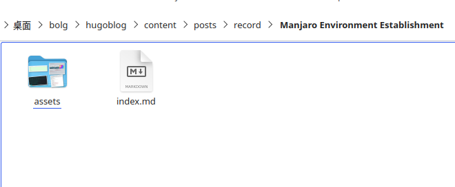

但思源的markdown语法有一些和标准的语法不同，例如标准语法中不允许文件名中存在空格，在行内代码中没有加粗字体等。需要在平时编写时注意。

因此，我使用思源笔记编写完文章后，如果需要推送到博客，则通过下列步骤实现

> 1. 在思源中导出md格式的压缩包，包含资源文件夹、md源文件
> 2. hugo博客文件夹content下对应的分类中，新建笔记文件夹
> 3. 复制资源文件夹、md源文件到笔记文件夹
> 4. 修改md文件，添加front头部
> 5. 编译hugo

## 侧边目录

参考：[Hugo博客目录放在侧边 | PaperMod主题](https://www.sulvblog.cn/posts/blog/hugo_toc_side/)

首先找到目录 layouts/partials/toc.html，替换其中的代码为下列代码：

```shell
{{- $headers := findRE "<h[1-6].*?>(.|\n])+?</h[1-6]>" .Content -}}
{{- $has_headers := ge (len $headers) 1 -}}
{{- if $has_headers -}}
<aside id="toc-container" class="toc-container wide">
    <div class="toc">
        <details {{if (.Param "TocOpen") }} open{{ end }}>
            <summary accesskey="c" title="(Alt + C)">
                <span class="details">{{- i18n "toc" | default "Table of Contents" }}</span>
            </summary>

            <div class="inner">
                {{- $largest := 6 -}}
                {{- range $headers -}}
                {{- $headerLevel := index (findRE "[1-6]" . 1) 0 -}}
                {{- $headerLevel := len (seq $headerLevel) -}}
                {{- if lt $headerLevel $largest -}}
                {{- $largest = $headerLevel -}}
                {{- end -}}
                {{- end -}}

                {{- $firstHeaderLevel := len (seq (index (findRE "[1-6]" (index $headers 0) 1) 0)) -}}

                {{- $.Scratch.Set "bareul" slice -}}
                <ul>
                    {{- range seq (sub $firstHeaderLevel $largest) -}}
                    <ul>
                        {{- $.Scratch.Add "bareul" (sub (add $largest .) 1) -}}
                        {{- end -}}
                        {{- range $i, $header := $headers -}}
                        {{- $headerLevel := index (findRE "[1-6]" . 1) 0 -}}
                        {{- $headerLevel := len (seq $headerLevel) -}}

                        {{/* get id="xyz" */}}
                        {{- $id := index (findRE "(id=\"(.*?)\")" $header 9) 0 }}

                        {{- /* strip id="" to leave xyz, no way to get regex capturing groups in hugo */ -}}
                        {{- $cleanedID := replace (replace $id "id=\"" "") "\"" "" }}
                        {{- $header := replaceRE "<h[1-6].*?>((.|\n])+?)</h[1-6]>" "$1" $header -}}

                        {{- if ne $i 0 -}}
                        {{- $prevHeaderLevel := index (findRE "[1-6]" (index $headers (sub $i 1)) 1) 0 -}}
                        {{- $prevHeaderLevel := len (seq $prevHeaderLevel) -}}
                        {{- if gt $headerLevel $prevHeaderLevel -}}
                        {{- range seq $prevHeaderLevel (sub $headerLevel 1) -}}
                        <ul>
                            {{/* the first should not be recorded */}}
                            {{- if ne $prevHeaderLevel . -}}
                            {{- $.Scratch.Add "bareul" . -}}
                            {{- end -}}
                            {{- end -}}
                            {{- else -}}
                            </li>
                            {{- if lt $headerLevel $prevHeaderLevel -}}
                            {{- range seq (sub $prevHeaderLevel 1) -1 $headerLevel -}}
                            {{- if in ($.Scratch.Get "bareul") . -}}
                        </ul>
                        {{/* manually do pop item */}}
                        {{- $tmp := $.Scratch.Get "bareul" -}}
                        {{- $.Scratch.Delete "bareul" -}}
                        {{- $.Scratch.Set "bareul" slice}}
                        {{- range seq (sub (len $tmp) 1) -}}
                        {{- $.Scratch.Add "bareul" (index $tmp (sub . 1)) -}}
                        {{- end -}}
                        {{- else -}}
                    </ul>
                    </li>
                    {{- end -}}
                    {{- end -}}
                    {{- end -}}
                    {{- end }}
                    <li>
                        <a href="#{{- $cleanedID -}}" aria-label="{{- $header | plainify -}}">{{- $header | safeHTML -}}</a>
                        {{- else }}
                    <li>
                        <a href="#{{- $cleanedID -}}" aria-label="{{- $header | plainify -}}">{{- $header | safeHTML -}}</a>
                        {{- end -}}
                        {{- end -}}
                        <!-- {{- $firstHeaderLevel := len (seq (index (findRE "[1-6]" (index $headers 0) 1) 0)) -}} -->
                        {{- $firstHeaderLevel := $largest }}
                        {{- $lastHeaderLevel := len (seq (index (findRE "[1-6]" (index $headers (sub (len $headers) 1)) 1) 0)) }}
                    </li>
                    {{- range seq (sub $lastHeaderLevel $firstHeaderLevel) -}}
                    {{- if in ($.Scratch.Get "bareul") (add . $firstHeaderLevel) }}
                </ul>
                {{- else }}
                </ul>
                </li>
                {{- end -}}
                {{- end }}
                </ul>
            </div>
        </details>
    </div>
</aside>
<script>
    let activeElement;
    let elements;
    window.addEventListener('DOMContentLoaded', function (event) {
        checkTocPosition();

        elements = document.querySelectorAll('h1[id],h2[id],h3[id],h4[id],h5[id],h6[id]');
         // Make the first header active
         activeElement = elements[0];
         const id = encodeURI(activeElement.getAttribute('id')).toLowerCase();
         document.querySelector(`.inner ul li a[href="#${id}"]`).classList.add('active');
     }, false);

    window.addEventListener('resize', function(event) {
        checkTocPosition();
    }, false);

    window.addEventListener('scroll', () => {
        // Check if there is an object in the top half of the screen or keep the last item active
        activeElement = Array.from(elements).find((element) => {
            if ((getOffsetTop(element) - window.pageYOffset) > 0 && 
                (getOffsetTop(element) - window.pageYOffset) < window.innerHeight/2) {
                return element;
            }
        }) || activeElement

        elements.forEach(element => {
             const id = encodeURI(element.getAttribute('id')).toLowerCase();
             if (element === activeElement){
                 document.querySelector(`.inner ul li a[href="#${id}"]`).classList.add('active');
             } else {
                 document.querySelector(`.inner ul li a[href="#${id}"]`).classList.remove('active');
             }
         })
     }, false);

    const main = parseInt(getComputedStyle(document.body).getPropertyValue('--article-width'), 10);
    const toc = parseInt(getComputedStyle(document.body).getPropertyValue('--toc-width'), 10);
    const gap = parseInt(getComputedStyle(document.body).getPropertyValue('--gap'), 10);

    function checkTocPosition() {
        const width = document.body.scrollWidth;

        if (width - main - (toc * 2) - (gap * 4) > 0) {
            document.getElementById("toc-container").classList.add("wide");
        } else {
            document.getElementById("toc-container").classList.remove("wide");
        }
    }

    function getOffsetTop(element) {
        if (!element.getClientRects().length) {
            return 0;
        }
        let rect = element.getBoundingClientRect();
        let win = element.ownerDocument.defaultView;
        return rect.top + win.pageYOffset;   
    }
</script>
{{- end }}
```

找到目录 layouts/_default/single.html，调用toc.html，注意：这里默认是有调用的，防止有人自定义了文件名称，但是没有调用相关代码导致展示失败。

```shell
  {{- if (.Param "ShowToc") }}
  {{- partial "toc.html" . }}
  {{- end }}
```

找到目录 css/extended/blank.css ，复制如下代码

```shell
:root {
    --nav-width: 1380px;
    --article-width: 650px;
    --toc-width: 300px;
}

.toc {
    margin: 0 2px 40px 2px;
    border: 1px solid var(--border);
    background: var(--entry);
    border-radius: var(--radius);
    padding: 0.4em;
}

.toc-container.wide {
    position: absolute;
    height: 100%;
    border-right: 1px solid var(--border);
    left: calc((var(--toc-width) + var(--gap)) * -1);
    top: calc(var(--gap) * 2);
    width: var(--toc-width);
}

.wide .toc {
    position: sticky;
    top: var(--gap);
    border: unset;
    background: unset;
    border-radius: unset;
    width: 100%;
    margin: 0 2px 40px 2px;
}

.toc details summary {
    cursor: zoom-in;
    margin-inline-start: 20px;
    padding: 12px 0;
}

.toc details[open] summary {
    font-weight: 500;
}

.toc-container.wide .toc .inner {
    margin: 0;
}

.active {
    font-size: 110%;
    font-weight: 600;
}

.toc ul {
    list-style-type: circle;
}

.toc .inner {
    margin: 0 0 0 20px;
    padding: 0px 15px 15px 20px;
    font-size: 16px;

    /*目录显示高度*/
    max-height: 83vh;
    overflow-y: auto;
}

.toc .inner::-webkit-scrollbar-thumb {  /*滚动条*/
    background: var(--border);
    border: 7px solid var(--theme);
    border-radius: var(--radius);
}

.toc li ul {
    margin-inline-start: calc(var(--gap) * 0.5);
    list-style-type: none;
}

.toc li {
    list-style: none;
    font-size: 0.95rem;
    padding-bottom: 5px;
}

.toc li a:hover {
    color: var(--secondary);
}
```
## md的表格样式

加入到`blank.css`中即可。

参考：[Markdown 渲染风格](https://dvel.me/posts/hugo-papermod-config/#markdown-%e6%b8%b2%e6%9f%93%e9%a3%8e%e6%a0%bc)

```shell
/* GitHub 样式的表格 */
.post-content table tr {
    border: 1px solid #979da3 !important;
}
.post-content table tr:nth-child(2n),
.post-content thead {
    background-color: var(--code-bg);
}
.post-content table th {
    border: 1px solid #979da3 !important;
}
.post-content table td {
    border: 1px solid #979da3 !important;
}
```

## Hugo博客修改post_meta头部信息

参考：[Hugo博客修改post_meta头部信息](https://www.sulvblog.cn/posts/blog/hugo_postmeta/)

post_meta是指文章的标题下面显示的一些基本信息，如下图：

​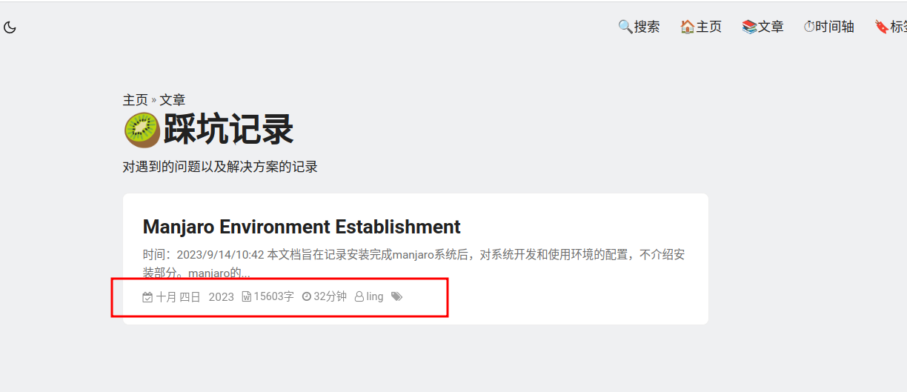​

post_meta只影响在分类界面看到的简介信息。在浏览文章的界面中，也可以显示这类信息，但由`./layouts/_default/single.html`​来控制，因此需要在`single.html`​合适的位置引入post_meta，才能够正常显示。浏览文章的界面的显示如下图

​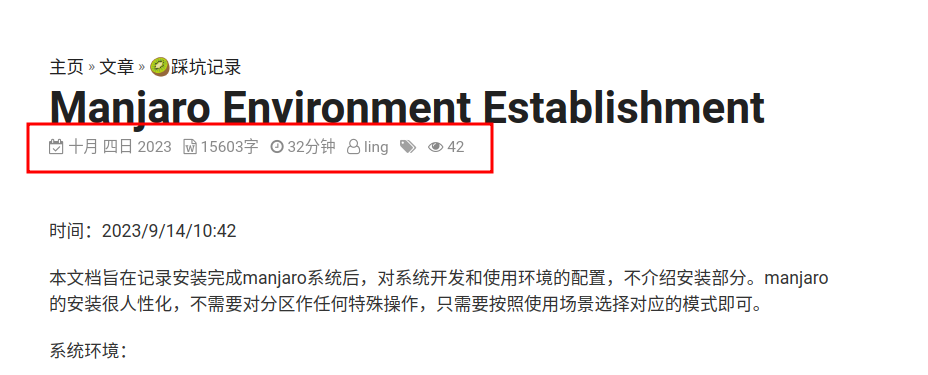​

## 基本头部信息修改

在hugo的hugo.yml配置文件加上这些字段

```yml
# 请写到params这个参数下面
params:
    DateFormat: "2006-01-02"
    ShowWordCounts: true
    ShowReadingTime: true
    ShowLastMod: true
```

在每篇文章开头记得加上这三个字段，在**新文章**部分已经在 archetypes/default.md 里面添加了这三个部分，这样每次通过命令行创建文章就会自动生成。

在`.layouts/partials/extend_head.html`​中引入需要的头部文件

```yml
{{ if (.Params.mermaid) }}
<script defer src="https://unpkg.com/mermaid@8.8.1/dist/mermaid.min.js"></script>
{{ end }}
<link rel="stylesheet" href="https://cdn.jsdelivr.net/npm/font-awesome@4.7.0/css/font-awesome.min.css">
<script src="//busuanzi.ibruce.info/busuanzi/2.3/busuanzi.pure.mini.js"></script>
<script src="https://cdn.jsdelivr.net/npm/jquery@3.6.3/dist/jquery.min.js"></script>
```

### 修改post_meta.html

定位到文件：layouts/partials/post_meta.html，添加如下代码

```shell
<!--如果单独复制这段代码，需要从 extend_head.html 中找到 font-awesome 引入，如下-->
<!--<link rel="stylesheet" href="https://cdn.jsdelivr.net/npm/font-awesome@4.7.0/css/font-awesome.min.css">-->
<style>
    i[id*="post_meta_style"] {
        display: flex;
        align-items: center;
        margin: 0 0 10px 0;
    }

    .parent-post-meta {
        display: flex;
        flex-wrap: wrap;
        opacity: 0.8;
    }

    .year {
        font-size: 14px; /* 调整字体大小为您想要的大小 */
    }
</style>

<span class="parent-post-meta">
    <span id="post_meta_style_1">
        <span class="fa fa-calendar-check-o"></span>
        <span>
            {{ partial "date.html"  . }}
            &nbsp;
            <span class="year">{{ .Date.Format " 2006" }}</span>
            <!--{{- (.Date.Format (default "01月 2, 2006")) }}-->
            &nbsp;&nbsp;
        </span>
    </span>
    <!--    <span id="post_meta_style_2">-->
    <!--        <span class="fa fa-calendar-plus-o"></span>-->
    <!--        <span>-->
    <!--            &nbsp;更新&nbsp;{{- (.Lastmod.Format (.Site.Params.dateFormat | default "2006-01-02")) }}-->
    <!--            &nbsp;|&nbsp;-->
    <!--        </span>-->
    <!--    </span>-->
    <span id="post_meta_style_3">
        <span class="fa fa-file-word-o"></span>
        <span>
            {{- .WordCount }}字
            &nbsp;&nbsp;
        </span>
    </span>
    <span id="post_meta_style_4">
        <span class="fa fa-clock-o"></span>
        <span>
            {{- .ReadingTime }}分钟
            &nbsp;&nbsp;
        </span>
    </span>
    <span id="post_meta_style_5">
        <span class="fa fa-user-o"></span>
        <span>
            {{- with (partial "author.html" .) }}
            {{- . }}
            {{- end }}
            &nbsp;&nbsp;
        </span>
    </span>
    <span id="post_meta_style_6">
        <span class="fa fa-tags" style="opacity: 0.8"></span>
        <span>
            {{- if .Params.tags }}
            <span class="post-tags-meta">
                {{- range $index, $value := ($.GetTerms "tags") }}
                {{- if eq $index 0}}
                <a href="{{ .Permalink }}" style="color: var(--secondary)!important;">{{ .LinkTitle }}</a>
                {{- else }}
                &nbsp;<a href="{{ .Permalink }}" style="color: var(--secondary)!important;">{{ .LinkTitle }}</a>
                {{- end }}
                {{- end }}
            </span>
            {{- end }}
        </span>
    </span>
</span>
```

其中关于日期的部分，参考了下列文章，将日月部分改成了中文，年份仍为数字显示。

日期更改为中文显示：[将 HUGO 日期输出为中文](https://tin6.com/post/convert-hugo-dateformat-to-chinese-words/)

首先，建立新文件`./data/chinese_date.yml`​在其中输入下列代码

```yml
year:
  '2010': 二〇一一年
  '2012': 二〇一二年
  '2013': 二〇一三年
  '2014': 二〇一四年
  '2015': 二〇一五年
  '2016': 二〇一六年
  '2017': 二〇一七年
  '2018': 二〇一八年
  '2019': 二〇一九年
  '2020': 二〇二〇年
  '2021': 二〇二一年
  '2022': 二〇二二年
  '2023': 二〇二三年
  '2024': 二〇二四年
  '2025': 二〇二五年
  '2026': 二〇二六年
  '2027': 二〇二七年
  '2028': 二〇二八年
  '2029': 二〇二九年
  '2030': 二〇三〇年
  '2031': 二〇三一年
  '2032': 二〇三二年
  '2033': 二〇三三年
  '2034': 二〇三四年
  '2035': 二〇三五年
  '2036': 二〇三六年
month:
  '1': 一月
  '2': 二月
  '3': 三月
  '4': 四月
  '5': 五月
  '6': 六月
  '7': 七月
  '8': 八月
  '9': 九月
  '10': 十月
  '11': 十一月
  '12': 十二月
day:
  '1': 一日
  '2': 二日
  '3': 三日
  '4': 四日
  '5': 五日
  '6': 六日
  '7': 七日
  '8': 八日
  '9': 九日
  '10': 十日
  '11': 十一日
  '12': 十二日
  '13': 十三日
  '14': 十四日
  '15': 十五日
  '16': 十六日
  '17': 十七日
  '18': 十八日
  '19': 十九日
  '20': 二十日
  '21': 二十一日
  '22': 二十二日
  '23': 二十三日
  '24': 二十四日
  '25': 二十五日
  '26': 二十六日
  '27': 二十七日
  '28': 二十八日
  '29': 二十九日
  '30': 三十日
  '31': 三十一日


```

然后建立新文件`./layouts/partials/date.html`​，写入下列代码，如果年份也需要显示中文，则取消第一行的注释。

```html
<!--{{ index $.Site.Data.chinese_date.year (printf "%d" .Date.Year) }}-->
{{ index $.Site.Data.chinese_date.month (printf "%d" .Date.Month) }}
{{ index $.Site.Data.chinese_date.day (printf "%d" .Date.Day) }}
```

在需要显示日期的位置输入下列代码

```yml
{{ partial "date.html"  . }}
```

就可以显示中文的月和日。

下列是post_meta.html中的修改。

```html
<span>
    {{ partial "date.html"  . }}
    &nbsp;
    <span class="year">{{ .Date.Format " 2006" }}</span>
    <!--{{- (.Date.Format (default "01月 2, 2006")) }}-->
    &nbsp;&nbsp;
</span>
```

### single.html

文件`./layouts/_default/single.html`​中默认包含了post_meta.html，因此，不需要对single.html做任何更改就可以正常显示头部信息。如希望文章详情界面和分类查看文章简介界面两个部分的头部信息不同，可以在下面的注释后加入自定的头部信息。例如评论信息。可以参考：[Hugo博客修改post_meta头部信息](https://www.sulvblog.cn/posts/blog/hugo_postmeta/) 中对评论的添加。

此处将浏览量放在单独界面中进行显示，因为列表中显示会有bug，只显示第一个而不显示后续的浏览量，且浏览量是总体浏览量而不是单个文章。

```html
{{- if not (.Param "hideMeta") }}
<div class="post-meta">
    {{- partial "post_meta.html" . -}} <!--在这里引用头部信息-->
    <span style="opacity: 0.8;">
          <span id="post_meta_style_7">
              &nbsp;&nbsp;
              <span class="fa fa-eye" ></span>
              <span>
                  <span id="busuanzi_container_page_pv"><span id="busuanzi_value_page_pv"></span></span>
                  &nbsp;&nbsp;
              </span>
          </span>
    </span>
    {{- partial "translation_list.html" . -}}
    {{- partial "edit_post.html" . -}}
    {{- partial "post_canonical.html" . -}}
</div>
{{- end }}
```

## 编译

当所有配置和内容都更改完成后，通过命令行进行编译

```git
hugo
```

编译出的内容全部放在`./public`​下，把该文件夹下的内容push到github的pages仓库，当访问该仓库时，就可以看到博客的主页。

# 在github pages上搭建博客

参考：[利用 Hugo 和 Github Pages 创建静态博客并实现自动部署](https://www.yuweihung.com/posts/2021/hugo-github-pages-blog/)

## 创建github仓库

仓库名为：Github 用户名 + `.github.io`​。这是github的pages功能，当访问`https://username.github.io`​时，就可以访问其main分支保存的静态网页。

注意不要选择`Add a README file`​，如果选择，后续访问时默认跳转到README，而不是跳转到博客首页。如果已经新建了，则在后续提交时将该文件删除即可。

​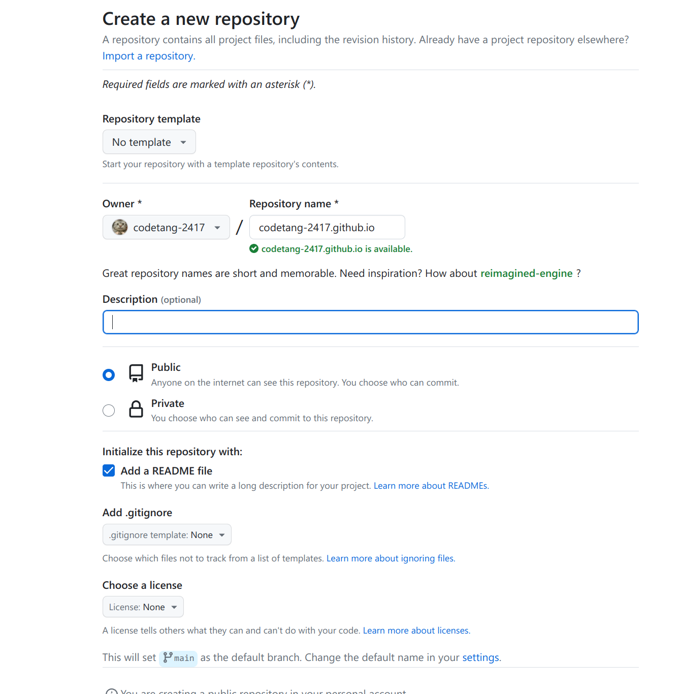​

当根据前面的步骤编译完hugo静态网站后，public目录下将会出现博客的静态网站的所有文件。在public目录下新建一个git仓库并推送刚刚建立的pages仓库。

在public目录下，命令行执行

```git
git init
git add .
git commit -m 'init hugo'
git remote add origin 仓库地址
git push -u origin main
```

会将当前public下的代码提交到github的main分支。

上述操作只提交了用于Pages 展示博客网站的代码。没有提交建站的代码，在hugo网站的根目录下初始化git，将建站代码提交到上述仓库的新分支`source`​。

后续对建站源码改动时，提交到source分支。发布网站的代码提交到main分支。

‍

## Github Actions 自动部署

在`github.io`​仓库下建立两个分支，一个用于储存网站代码的`source`​分支，一个用于储存对外发布的静态网站代码的`main`​分支。通过github的action功能，可以实现source分支由代码push时，自动编译并发布新网页到main分支。实现自动更新网站的功能。

在配置完网站代码后，需要在根目录添加`.gitignore`​文件，忽略hugo编译过程中产生的public目录中的内容

```git
.hugo_build.lock
public/

```

然后就可以push代码到source分支。在网站根目录，初始化git仓库后，输入下列指令

```git
git init
git add .
git commit -m 'init hugo'
git remote add origin 仓库地址
git push -u origin source
```

如果github上没有该分支，会自动创建分支。

如果github刚建立没有main分支，可以手动在public目录下push代码到main分支。此时通过page功能应该会默认使用main分支作为page功能的分支。

### 获取github令牌

参考：[利用GitHub Action实现Hugo博客在GitHub Pages自动部署](https://lucumt.info/post/hugo/using-github-action-to-auto-build-deploy/)

在个人`GitHub`​页面，依次点击`Settings`​->`Developer settings`​->`Personal access tokens`​进入如下页面

​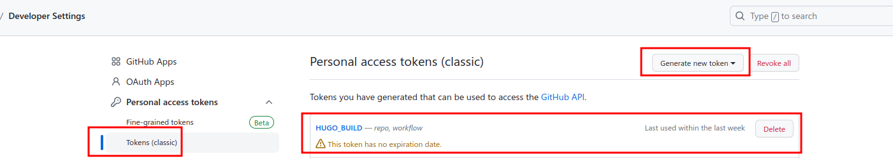​

点击`Generate new token`​出现如下界面，在Note中输入名称，在Select scopes选择`workflow`​，NOTE名称开头不要出现GITHUB等字样。

​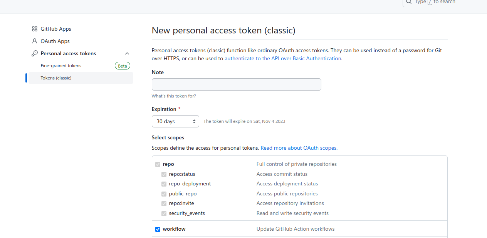​

生成的token复制出来为后续创建`secret`​做准备，注意必须及时复制，一旦离开此页面后续就无法查看其值，只能重新创建新token：

​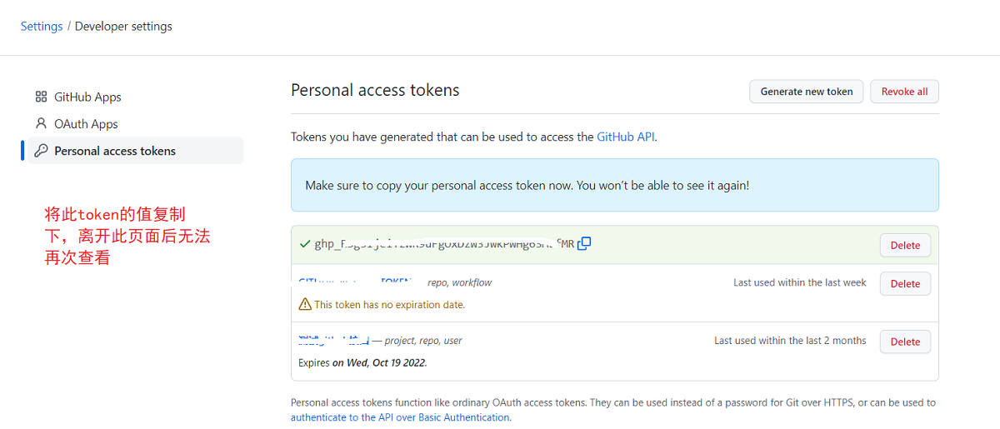​

‍

### 在项目设置中添加ACTION secret

进入对应的`GitHub`​项目下，依次点击`Settings`​->`Secrets`​->`Actions`​进入添加`Action secrets`​的界面，点击`New repository secret`​按钮

​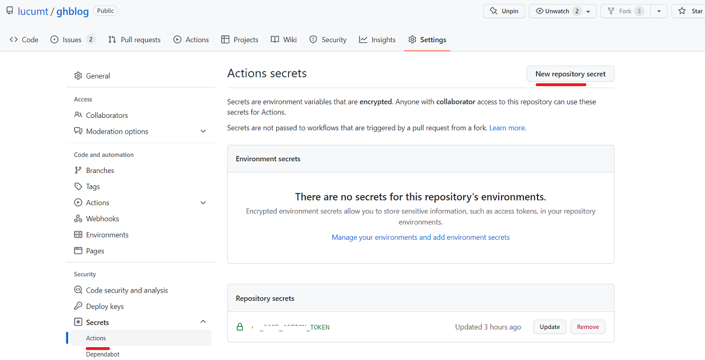​

在出现的界面中`name`​部分输入设置`token`​时的`note`​值，`Secret`​部分输入步骤3中记录的`token`​值，然后点击`Add secret`​按钮。

## 添加Action行为代码

然后在网站根目录建立文件`.github/workflows/pages-automatic-deploy.yml`​，文件命令可以随意命令，但注意是yml格式。

然后填入以下内容，注意下列代码中的`secrets.HUGO_BUILD`​需要替换为自己设置令牌`token`​时的note值。

```git
name: pages-auto-build-deploy
on:
  # workflow_dispatch:
  push:
    branches:
      - source

jobs:
  build-and-deploy:
    runs-on: ubuntu-latest
    steps:
      - uses: actions/checkout@v2
        with:
          submodules: recursive
          fetch-depth: 0

      - name: Setup Hugo
        uses: peaceiris/actions-hugo@v2
        with:
          hugo-version: 'latest'
          extended: true

      - name: Build Hugo
        run: hugo

      - name: Deploy
        uses: peaceiris/actions-gh-pages@v3
        with:
          github_token: ${{ secrets.HUGO_BUILD }}
          publish_branch: main
          publish_dir: ./public
          commit_message: ${{ github.event.head_commit.message }}

```

对yml中内容的解释：

> 这是一个 GitHub Actions 的工作流配置文件，用于自动构建和部署静态网站，通常是使用 Hugo 静态网站生成器生成的。以下是对这个配置文件的详细分析：
>
> 1. ​`name: pages-auto-build-deploy`​: 这个工作流的名称，通常是描述工作流的简短文本。
> 2. ​`on`​: 定义触发工作流的事件。在这里，工作流会在代码推送到 `source`​ 分支时触发。只有当 `source`​ 分支有推送时，该工作流才会执行。
> 3. ​`jobs`​: 定义一个或多个工作流任务。
>
>     * ​`build-and-deploy`​: 工作流中的一个任务。这个任务的名称是 "build-and-deploy"，您可以在工作流中定义多个任务，每个任务都有自己的名称。
>
>       * ​`runs-on`​: 指定在哪种类型的虚拟机上运行任务。在这里，任务将在 Ubuntu 最新 虚拟机上运行。
>       * ​`steps`​: 定义任务的一系列操作步骤。
>
>         * ​`uses: actions/checkout@v2`​: 使用 GitHub 提供的 `actions/checkout`​ 动作，将代码检出到工作目录中。这个动作通常用于获取存储在仓库中的代码。在这里，它还使用了一些参数：
>
>           * ​`submodules: recursive`​：递归地获取仓库中的子模块（如果有的话）。
>           * ​`fetch-depth: 0`​：获取完整的版本历史，包括 `.GitInfo`​ 和 `.Lastmod`​。
>         * ​`name: Setup Hugo`​: 给这一步取一个名字，以便更好地理解它的作用。这一步使用 `peaceiris/actions-hugo`​ 动作来设置 Hugo 静态网站生成器，具体配置如下：
>
>           * ​`hugo-version: "latest"`​：使用最新版本的 Hugo。
>           * ​`extended: true`​：启用 Hugo 的扩展功能。
>         * ​`name: Build`​: 给这一步取一个名字，这一步运行 `hugo`​ 命令，用于构建静态网站。
>         * ​`name: Deploy`​: 给这一步取一个名字，这一步使用 `peaceiris/actions-gh-pages`​ 动作来部署静态网站到 GitHub Pages。具体配置如下：
>
>           * ​`github_token: ${{ secrets.HUGO_BUILD }}`​：用于身份验证的 GitHub 令牌，从 GitHub 仓库的 Secrets 中获取。
>           * ​`publish_dir: ./public`​：指定要发布的静态网站文件的目录。
>           * ​`publish_branch: main`​：指定要发布到的分支，通常是 GitHub Pages 托管的分支。
>           * ​`cname: your_domain`​：如果有自定义域名，可以在这里设置它。
>
> 这个工作流的主要目标是在代码推送到 `source`​ 分支后，构建 Hugo 静态网站并将其部署到 GitHub Pages。它使用了一些第三方的 GitHub Actions 动作来简化这个流程，并配置了一些参数来适应特定需求。请确保在您的 GitHub 仓库的设置中配置了相应的 Secrets，以便工作流能够成功访问 GitHub 仓库并执行部署操作。

关于Deploy中使用到的action详细介绍： [actions-gh-pages](https://github.com/peaceiris/actions-gh-pages)。

如果不使用`publish_branch`​字段，也更改手动Page所使用的分支，如下图，在对应仓库的设置中进行修改。

​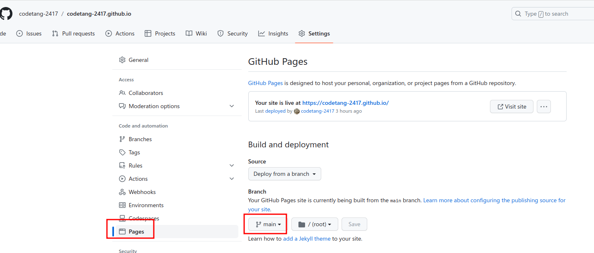​

当push代码到source分支后，​`GitHub Actions`​会开启自动构建部署，运行结果如下

​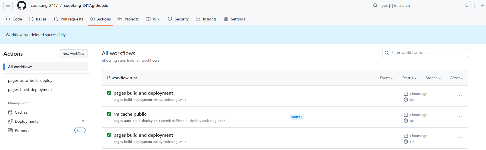

# 博客seo优化

SEO（搜索引擎优化）指的是一系列的策略和技术，旨在提高博客在搜索引擎结果页面（SERP）上的可见性和排名。SEO的目标是使博客在搜索引擎中更容易被用户找到，从而吸引更多的有针对性的流量。

参考：[Hugo博客seo优化](https://www.sulvblog.cn/posts/blog/hugo_seo/)

## 页面关键词

为每篇博客文章设置标题、关键词、描述

```yml
title: seo优化
keywords:
- seo
- hugo
description: "hugo博客seo优化"
```

## 页面描述

在站点目录下的config中添加博客描述有利于搜索

```yml
params:
	description: "Sulv的个人博客，hugo，papermod，golang，mysql，微服务"
```

## Google搜索优化

第一步，进入[Google Search Console](https://search.google.com/search-console)点击添加资源，输入自己的网站。比如我的是https://codetang-2417.github.io，选择第二种验证方式，然后下载一个html文件放到hugo站点的static文件夹下，然后重新部署站点，回到Google Search Console页面点击验证，如果能访问到表示验证成功。

​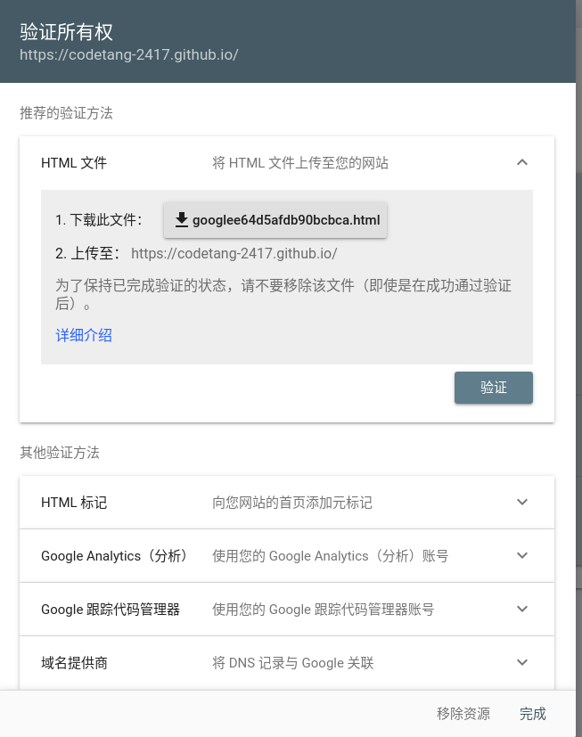​

第二步，在Google Search Console页面点击站点地图，输入当前站点的sitemap.xml，也有可能是其他后缀，hugo部署后一般会自动生成sitemap，在根目录下，如：https://codetang-2417.github.io/sitemap.xml

​​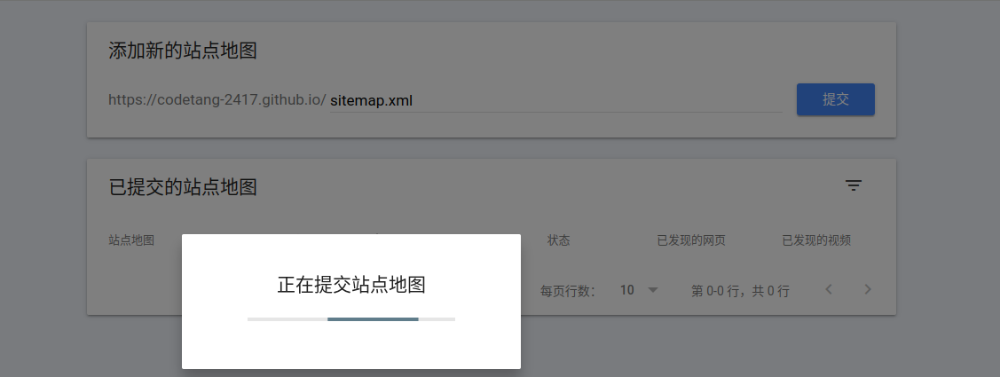​​

## 百度搜索优化

进入[百度搜索资源平台](https://ziyuan.baidu.com/)，选择 用户中心->站点管理->添加网站，添加上你自己的网站，这里的验证方式也可以选择下载html的方式，步骤和google的一样，验证成功后选择 搜索服务->普通收录->sitemap，输入sitemap的网址，和google的站点地图一样，如我的是： https://codetang-2417.github.io/sitemap.xml。注意百度不容许以子目录的方式提交子站点，和google不一样，只能在提交sitemap文件时，提交多个sitemap文件。

## 必应搜索优化

进入[Bing Webmaster Tools](https://www.bing.com/webmasters)，登录后直接导入google的数据就可以，很方便。

‍

# 评论系统

参考：[Hugo使用指北](https://hj24.life/posts/hugo%E4%BD%BF%E7%94%A8%E6%8C%87%E5%8C%97/)

### 添加 gittalk

用 gittalk 做评论系统

评论模块在主题里的路径是：`/path/to/site/themes/{theme}/layouts/partials/comments.html`​，只需要再站点目录的`/path/to/site/layouts/partials/comments.html`​写对应的内容就能覆盖这一部分了。

下面就给个例子，不同模板得看着自己的css样式啥的改成对应的，不过gittalk接入的代码都是一样的：

```html
<!-- gitalk -->
<div class="doc_comments">
	<div id="gitalk-container"></div>
</div>
<link rel="stylesheet" href="https://unpkg.com/gitalk/dist/gitalk.css">
<script src="https://unpkg.com/gitalk/dist/gitalk.min.js"></script>

<script type="text/javascript">
let gitalk = new Gitalk({
  clientID: '换成你自己的',
  clientSecret: '换成你自己的',
  repo: 'xxx.github.io',
  owner: 'xxx',
  admin: ['xxx'],
  id: '{{ .Params.Date }}',      // Ensure uniqueness and length less than 50
  distractionFreeMode: false,  // Facebook-like distraction free mode
  title : '{{ .Params.Title }}',
  labels : []
});
gitalk.render('gitalk-container')
</script>
```

接入 gittalk 之前要去申请 Github OAuth App，可以点[这里](https://github.com/settings/applications/new)申请，几个需要填写的内容：

|字段|内容|备注|
| ----------------------------| ----------------------| --------------|
|Application name|取一个名字|填写应用名称|
|Homepage URL|https://你的域名|主页地址|
|Application description|描述，自己写就可以了|备注|
|Authorization callback URL|和上面的域名一样|回调地址|

注册完之后拿着你的 clientID 和 clientSecret 填到上面，在配置里把原主题自带的评论选项打开，就可以完成覆盖了:

```toml
[params.valine]
  enable = true
  appId = ""
  appKey = ""
  placeholder = " "
  visitor = true
```

‍
